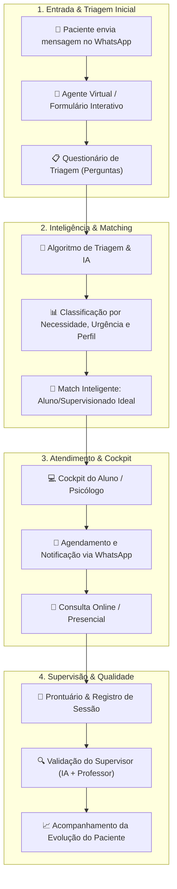

# Fluxo da Clínica Escola: Triagem WhatsApp, Matching por IA e Supervisão

Este documento apresenta a arquitetura funcional da **Clínica Escola (Viver Mais Psicologia / Instituto Braile)**, detalhando a jornada do paciente desde o primeiro contato via WhatsApp até o acompanhamento em supervisão clínica.

---

## 📊 Diagrama Visual do Fluxo

---

## ⚡ Detalhamento Etapa por Etapa

### 1. Entrada & Triagem Automática (WhatsApp)
* **Primeiro Contato:** O paciente acessa o WhatsApp da Clínica Escola.
* **Formulário/Perguntas Dinâmicas:** O robô interativo realiza perguntas básicas de triagem:
  * Queixa principal / motivo da busca por atendimento.
  * Disponibilidade de horários e modalidade (Online ou Presencial).
  * Perfil socioeconômico e preferências gerais.

### 2. Triagem Inteligente & Matching
* **Classificação:** O sistema categoriza o caso com base no nível de urgência, temática da queixa (ex: ansiedade, relações, luto) e requisitos específicos.
* **Algoritmo de Matching:** O paciente é automaticamente pareado com o **aluno de pós-graduação/estagiário** que possui a melhor aptidão técnica e disponibilidade de grade para aquele caso específico.

### 3. Agendamento & Cockpit do Aluno
* **Notificação do Aluno:** O aluno recebe a sugestão de paciente no seu **Cockpit de Atendimento** na plataforma web.
* **Confirmação Automatizada:** Assim que o aluno aceita o atendimento, o sistema envia automaticamente a confirmação e o link de acesso ao paciente via WhatsApp.
* **Lembretes:** Mensagens de lembrete são enviadas periodicamente antes de cada sessão para evitar faltas.

### 4. Registro de Sessão & Supervisão Clínica
* **Prontuário Digital:** Após a consulta (online ou presencial), o aluno preenche o prontuário no sistema.
* **Apoio de IA para Transcrição/Resumo:** Recursos de IA geram resumos clínicos das sessões e pré-análise de pontos de atenção.
* **Validação pelo Professor/Supervisor:** O professor supervisor revisa as condutas e feedbacks, garantindo padrão de excelência clínica e suporte acadêmico de alta qualidade ao aluno.
