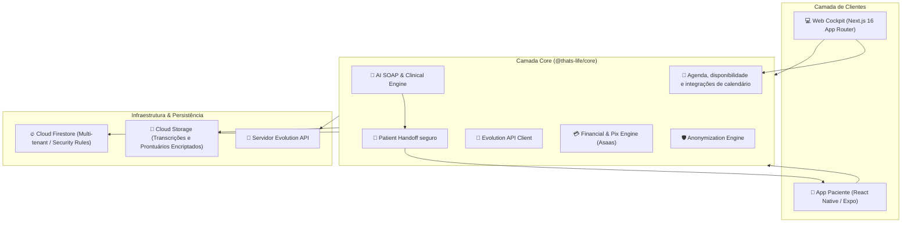
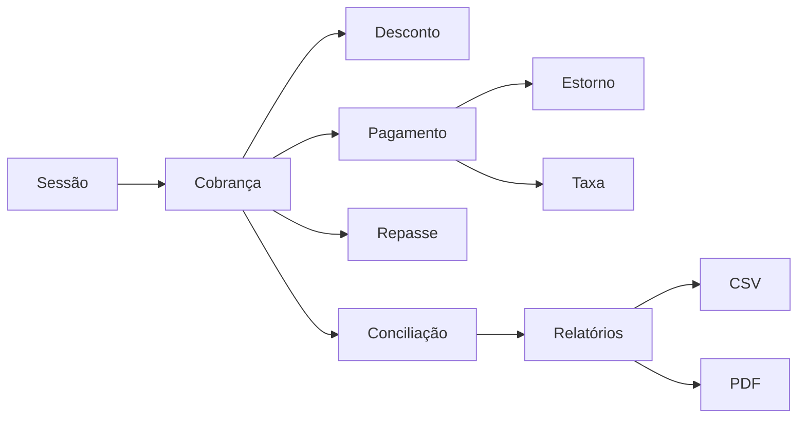
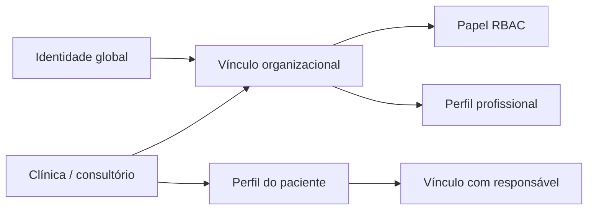
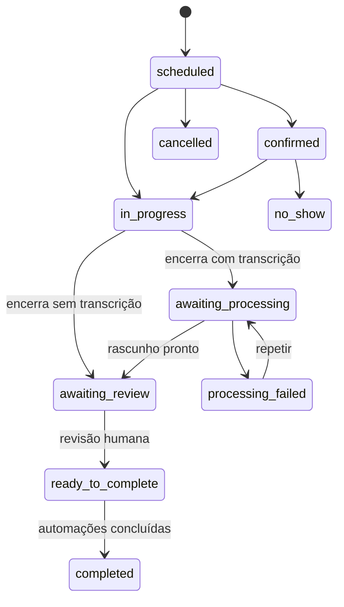
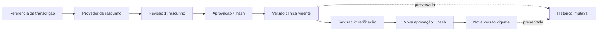
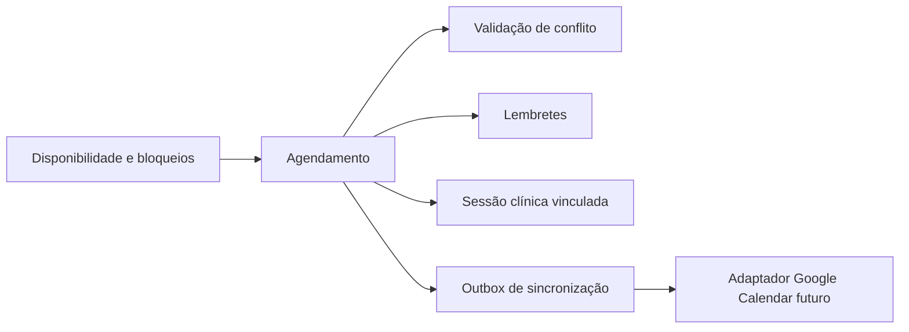
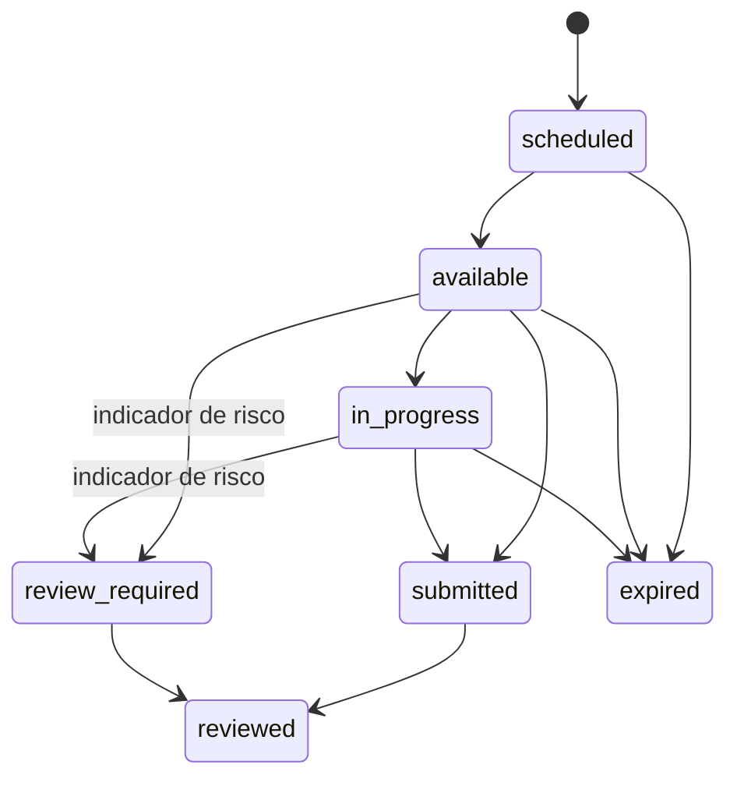
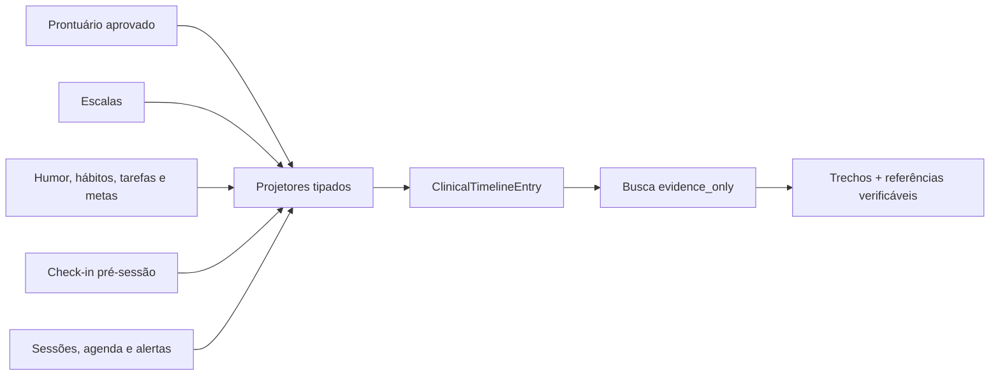

# Arquitetura Técnica — Thats Life (TL - Psi)

## Visão Geral do Sistema

O **Thats Life** adota uma arquitetura em Monorepo utilizando **TypeScript** de ponta a ponta, separando claramente as aplicações de front-end do pacote central de regras de negócio e integrações.

> **Estado atual:** web, mobile e core constituem um protótipo. Firestore, Storage,
> Firebase Auth, provedores de IA, Asaas e Evolution API representam a arquitetura
> alvo e ainda não estão conectados.

---

## 🛠️ Tecnologias Principais

1. **Aplicações Front-End:**
   * **Web:** Next.js 16 (React 19), Tailwind CSS / Vanilla CSS, Lucide Icons.
   * **Mobile:** React Native, Expo, React Navigation, NativeWind / StyleSheet.
2. **Pacote Core (`@thats-life/core`):**
   * TypeScript strictly-typed.
   * Regras de escore, prompts clínicos e anonimização heurística.
   * Contrato `PatientHandoff` separado do prontuário: resumo em linguagem acessível,
     tarefas autorizadas, próxima sessão e metadados de revisão humana.
   * Triagem bloqueia termos internos, hipóteses diagnósticas, conteúdo de risco e
     identificadores pessoais antes da aprovação; somente um rascunho aprovado pode
     assumir o estado de entregue.
   * Adaptadores reais para IA e Evolution API serão implementados apenas no servidor.
3. **Persistência & Backend:**
   * Arquitetura alvo: Firebase Firestore para persistência documental em tempo real.
   * Arquitetura alvo: Cloud Storage para áudios e anexos, com política de retenção.
   * Arquitetura alvo: Firebase Auth com controle de acesso por organização e papel.

---

## Domínio Financeiro

O módulo `packages/core/src/financial` não depende de banco, framework web ou
provedor de pagamentos. Valores são armazenados em **centavos inteiros** e todas
as entidades carregam os identificadores de organização, sessão, paciente e
profissional necessários para isolamento multi-tenant e conciliação.

### Camadas implementadas

1. **Domínio:** cobranças, descontos, pagamentos, estornos, taxas e repasses.
2. **Conciliação:** saldo por sessão, pagamento parcial, excesso, estorno,
   vencimento e cancelamento.
3. **Consultas:** período, organização, paciente, profissional, status e forma
   de pagamento.
4. **Relatórios:** faturamento, fluxo de caixa, contas a receber,
   inadimplência e repasses.
5. **Saídas:** CSV com separador compatível com Excel em português e PDF A4.
6. **Portas externas:** repositório, auditoria, idempotência, cobrança/Pix,
   webhook normalizado, NFSe e Receita Saúde.

`InMemoryFinancialRepository` é apenas um adaptador de desenvolvimento e testes.
O futuro adaptador Firestore deverá implementar `FinancialRepository`, enquanto
Asaas deverá implementar `BillingProviderPort`. Webhooks precisam validar
assinatura e passar por `IdempotencyRepository` antes de alterar o livro-razão.

Logs de auditoria não podem carregar nome, e-mail, telefone, CPF, transcrição ou
nota clínica do paciente. Documentos fiscais são uma exceção controlada e devem
ficar em coleção restrita, criptografada e com política própria de retenção.

---

## Identidade e Multi-Tenancy

O módulo `packages/core/src/identity` define identidade e autorização sem
dependência de Firebase, Clerk, Auth0 ou qualquer banco. O provedor futuro deverá
implementar `AuthenticationPort`, enquanto a persistência implementará
`IdentityRepository`.

### Regras de isolamento

1. Toda consulta de perfil exige `organizationId`; IDs isolados não concedem
   acesso.
2. A verificação de tenant ocorre antes da avaliação de papel ou permissão.
3. Um vínculo pode combinar papéis, como `owner + professional`, sem transformar
   permissões administrativas em permissões clínicas.
4. Proprietários e administradores não acessam prontuários automaticamente.
5. Profissionais acessam recursos clínicos somente de pacientes atribuídos ao
   próprio `professionalProfileId`.
6. Pacientes e responsáveis não são membros da clínica. Seus contextos são
   resolvidos pelo usuário autenticado e pelos vínculos explícitos.
7. O responsável não recebe acesso clínico automaticamente, mesmo quando sua
   autoridade é `legal_guardian`; cada capacidade deve ser concedida.
8. A organização deve manter ao menos um proprietário ativo.

### Papéis organizacionais

- `owner` e `admin`: administração organizacional, financeira e de membros, sem
  acesso automático ao prontuário.
- `clinical_director`: operação clínica e supervisão, sem gerenciar membros.
- `professional`: prontuário, sessões e avaliações dos pacientes atribuídos.
- `assistant`: cadastro, agenda e leitura financeira, sem prontuário.
- `billing`: cobrança, relatórios e dados mínimos de pacientes.
- `auditor`: leitura de auditoria, relatórios e finanças.

Credenciais, senhas e tokens nunca pertencem ao domínio. O core recebe apenas um
`AuthenticatedPrincipal` verificado pelo adaptador de autenticação e resolve o
contexto autorizado a partir dos vínculos armazenados.

---

## Sessão Clínica e Automação Pós-Sessão

O agregado `ClinicalSession`, em `packages/core/src/clinicalSession`, coordena o
ciclo da sessão sem depender de banco, fila, storage ou provedor de IA. Ele
mantém organização, paciente e profissionais atribuídos em todas as operações.

### Garantias do agregado

1. Gravação, processamento por IA e conteúdo entregue ao paciente possuem
   consentimentos separados, versionados e revogáveis.
2. A transcrição exige gravação vinculada, consentimento ativo e datas
   temporalmente consistentes.
3. Conteúdo gerado por IA nunca conclui a sessão sozinho: o prontuário requer
   aprovação humana.
4. Cobrança, recibo, notificação e entrega ao paciente são etapas rastreadas
   individualmente; a sessão só termina quando todas as etapas habilitadas
   estiverem concluídas.
5. Falhas de automação preservam código do erro e número de tentativas, e podem
   ser repetidas sem perder o histórico.
6. Comandos aceitam chave de idempotência e persistem agregado e eventos de
   outbox na mesma operação atômica.
7. Escritas usam versão otimista para impedir que duas operações sobrescrevam
   silenciosamente a mesma sessão.

### Portas de infraestrutura

- `ClinicalSessionRepository`: persistência transacional e consultas por
  organização, período, paciente, profissional e status.
- `SessionJobQueuePort`: despacho das automações pós-sessão.
- `RecordingStoragePort`: upload criptografado, confirmação por checksum,
  retenção e exclusão.
- `TranscriptionProviderPort`: transcrição desacoplada do fornecedor.
- `ClinicalDraftProviderPort`: geração desacoplada do rascunho clínico.

`InMemoryClinicalSessionRepository` é o adaptador de desenvolvimento e testes.
Uma implementação real deverá manter atomicidade entre a sessão, a chave de
idempotência e a outbox, independentemente da tecnologia de banco escolhida.

---

## Prontuário Clínico Versionado

O módulo `packages/core/src/clinicalRecord` representa o prontuário como um
agregado separado da sessão, da transcrição e do conteúdo compartilhado com o
paciente. O formato clínico atual é SOAP, mas nenhuma regra depende de uma API
de IA ou tecnologia de persistência.

### Garantias clínicas e de auditoria

1. Um rascunho assistido por IA exige proveniência com fornecedor, modelo,
   versão do prompt, transcrição de origem e data de geração.
2. O resultado da IA permanece em estado de rascunho até um profissional
   atribuído revisar e aprovar explicitamente.
3. Cada aprovação registra profissional, usuário, data, atestado de revisão e
   hash SHA-256 do conteúdo aprovado.
4. Retificações adicionam uma nova revisão e uma nova aprovação. O conteúdo e a
   assinatura das revisões anteriores permanecem preservados.
5. Toda criação exige uma data explícita de retenção; uma retenção legal pode
   suspender a eliminação pelo adaptador de persistência.
6. Eventos de domínio e auditoria de acesso não carregam campos SOAP,
   transcrição ou texto clínico.
7. Proprietários e administradores continuam sem acesso clínico automático.
   Profissionais visualizam apenas prontuários dos pacientes atribuídos.
8. Criação e alterações usam idempotência, versão otimista e outbox atômica.

### Portas de infraestrutura

- `ClinicalRecordRepository`: armazenamento e consulta sempre limitados por
  `organizationId`.
- `ClinicalRecordDraftProviderPort`: geração de SOAP sem acoplar o domínio ao
  fornecedor de IA.
- `ClinicalRecordContentProtectionPort`: criptografia e abertura do conteúdo
  pelo adaptador servidor.
- `ClinicalRecordAccessAuditPort`: auditoria obrigatória de leituras, listagens
  e acessos negados.

`InMemoryClinicalRecordRepository` e `InMemoryClinicalRecordAccessAudit` existem
somente para testes e desenvolvimento. A persistência real deverá cifrar o
conteúdo em repouso e manter agregado, idempotência e outbox na mesma transação.

---

## Agenda e futura integração com Google Calendar

O módulo `packages/core/src/scheduling` separa **agendamento** de **sessão
clínica**. O primeiro reserva e coordena o horário; a sessão passa a existir no
fluxo de atendimento e pode ser vinculada posteriormente. Isso impede que uma
mudança de calendário altere registros clínicos já produzidos.

### Regras implementadas

1. Cada agendamento pertence a uma organização, paciente e profissional.
2. O sistema valida intervalo, lembretes duplicados, ciclo de estados,
   concorrência otimista e conflito de horários do profissional.
3. Apenas profissionais atribuídos ao paciente — ou papéis internos com a
   permissão de agenda — podem alterar o horário.
4. A agenda suporta contratos para disponibilidade semanal, bloqueios,
   recorrência, lembretes e vínculo posterior à sessão clínica.
5. Criação, confirmação, reagendamento e cancelamento geram eventos de outbox
   idempotentes, prontos para notificações e sincronização externa.

### Google Calendar: contrato futuro

`ExternalCalendarProviderPort` é a fronteira para o futuro adaptador Google.
Ele prevê OAuth, envio/atualização/remoção de eventos e sincronização incremental
por cursor. A conexão persiste apenas:

- identificador da conta no provedor;
- calendário selecionado;
- estado, cursor e datas de sincronização;
- referências de eventos externos.

Tokens OAuth, segredos do cliente e códigos de autorização não são armazenados
no core nem enviados ao app. Eles deverão ser processados e cifrados somente no
servidor, pelo adaptador Google Calendar. Assim, cada psicólogo poderá conectar
sua agenda individualmente sem compartilhar credenciais com a clínica ou com
outros profissionais.

---

## Plano terapêutico e acompanhamento do paciente

O módulo `packages/core/src/carePlan` mantém metas, tarefas e registros de
humor que podem aparecer no app do paciente, sem reutilizar nem expor campos do
prontuário SOAP. Tarefas são filtradas contra referências a prontuário,
diagnóstico ou conteúdo de risco antes de se tornarem compartilháveis.

1. Pacientes só podem concluir suas próprias tarefas e registrar o próprio
   humor.
2. Responsáveis só interagem quando o vínculo explícito concede a capacidade
   correspondente.
3. Humor muito baixo abre um alerta operacional para revisão humana; não cria
   diagnóstico, conduta ou mensagem automática.
4. As portas de repositório separam planos, check-ins e alertas, preparando a
   persistência e o painel clínico sem misturar dados com o prontuário.

---

## Preparação pré-sessão

O módulo `packages/core/src/preSessionCheckIn` coordena o check-in vinculado a
um agendamento. Ele aceita indicadores estruturados, uma avaliação validada e
um campo opcional para assuntos que o paciente queira abordar.

1. O paciente pode deixar `topicsToDiscuss` vazio sem impedir o envio.
2. O texto é limitado a mil caracteres, preservado sem reescrita automática e
   não aparece nos eventos de domínio.
3. O briefing é material de preparação e nunca é incorporado automaticamente
   ao prontuário SOAP.
4. Humor muito baixo ou risco proveniente de instrumento validado exige revisão
   humana; não produz diagnóstico, conduta ou mensagem automática.
5. Pacientes só enviam o próprio check-in. Profissionais precisam estar
   atribuídos ao paciente para revisar o conteúdo.
6. Escritas usam versão otimista, chave de idempotência e eventos de outbox.

`InMemoryPreSessionCheckInRepository` permite validar o workflow antes da
persistência. Um futuro adaptador Firestore deverá implementar
`PreSessionCheckInRepository` sem alterar o domínio.

---

## Linha do tempo clínica e memória verificável

O módulo `packages/core/src/clinicalTimeline` é uma projeção de leitura
reconstruível. Ele não substitui prontuário, avaliação, plano terapêutico ou
agenda: reúne referências para essas fontes em ordem longitudinal.

Cada entrada mantém:

- organização, paciente e profissionais autorizados;
- categoria, data e importância;
- trecho de evidência quando necessário;
- tipo, ID, versão, revisão e campo da fonte;
- hash SHA-256 quando a origem é uma revisão aprovada do prontuário.

### Garantias

1. Rascunhos de prontuário não entram na linha do tempo; apenas revisões
   aprovadas podem ser projetadas.
2. A busca atual é determinística e retorna `mode: evidence_only`. Ela não
   redige uma resposta clínica nem completa lacunas.
3. Consultas exigem `clinical_records.read`, vínculo do profissional com o
   paciente e auditoria sem armazenar o texto pesquisado.
4. A projeção pode ser refeita de forma idempotente a partir das fontes.
5. Trechos clínicos continuam sensíveis. O adaptador real deverá protegê-los em
   repouso e manter as mesmas regras de acesso do prontuário.
6. Um futuro copiloto somente poderá responder usando as entradas recuperadas e
   deverá citar cada fonte utilizada.

`InMemoryClinicalTimelineRepository` valida filtros e reconstrução antes do
Firestore. O futuro adaptador não será fonte de verdade: prontuário, avaliações,
care plan e eventos permanecem autoritativos.

---

## Comunicação e notificações

O módulo `packages/core/src/communication` normaliza mensagens transacionais
de agenda, tarefas e financeiro antes que qualquer provedor seja chamado.

1. Canal e categoria respeitam preferências e o consentimento mais recente do
   paciente.
2. Templates tipados impedem inclusão de SOAP, diagnóstico, conteúdo de risco
   ou notas clínicas.
3. A fila usa chave de idempotência, agendamento, limite de tentativas e estados
   `queued`, `sending`, `delivered`, `failed` e `cancelled`.
4. Auditoria registra categoria, canal, tentativa e resultado, nunca o corpo da
   mensagem ou o contato do paciente.
5. `NotificationDeliveryPort` permite adaptadores independentes para Evolution
   API, Expo Push e e-mail.
6. Credenciais e contatos reais pertencem somente aos adaptadores de servidor.

`InMemoryNotificationRepository` e `InMemoryCommunicationAudit` validam o
workflow sem infraestrutura. O cliente legado da Evolution não aceita mais
credencial padrão nem registra número ou texto em logs.

---

## Camada de aplicação local

`apps/web/src/server/application` coordena os módulos do core no servidor
Next.js. Route Handlers expõem a fronteira necessária ao app mobile e às
futuras integrações, enquanto regras clínicas e financeiras continuam no core.

O primeiro fluxo vertical executável é:

`contexto → autorização → agendamento → conflito → persistência → lembrete`

Todas as mutações exigem `Idempotency-Key`, carregam correlação e retornam erros
padronizados. O dashboard transversal consulta agenda, tarefas, finanças e fila
de comunicação em paralelo, sem tornar a projeção uma nova fonte de verdade.

O contexto atual é demonstrativo e resolvido por cabeçalhos contra vínculos em
memória. Ele não deve ser tratado como autenticação real. Estado, comandos e
filas podem desaparecer ou divergir entre processos; essa limitação será
substituída pelos adaptadores persistentes e pelo provedor de identidade.
