# 🧭 User Flow Diagram — Jornada do Paciente
## Plataforma Clínica Viver Mais

Este documento descreve a especificação técnica e visual do **Fluxo do Usuário / Paciente** (*User Flow*) desde a atração na vitrine pública até a confirmação do atendimento, pagamento e comunicação pós-sessão.

---

## 📊 Diagrama Completo do Fluxo (Mermaid)

```mermaid
flowchart TD
    %% Estilização dos Nós
    classDef entryStyle fill:#0f172a,stroke:#38bdf8,stroke-width:2.5px,color:#fff,rx:12px;
    classDef pageStyle fill:#042f2e,stroke:#2dd4bf,stroke-width:2px,color:#f0fdfa,rx:8px;
    classDef decisionStyle fill:#312e81,stroke:#a5b4fc,stroke-width:2px,color:#e0e7ff,rx:10px;
    classDef formStyle fill:#1e293b,stroke:#94a3b8,stroke-width:1.5px,color:#f8fafc,rx:8px;
    classDef asyncStyle fill:#581c87,stroke:#c084fc,stroke-width:2px,color:#faf5ff,rx:8px;
    classDef paymentStyle fill:#701a75,stroke:#f472b6,stroke-width:2px,color:#fdf2f8,rx:8px;
    classDef successStyle fill:#064e3b,stroke:#34d399,stroke-width:2.5px,color:#ecfdf5,rx:12px;
    classDef errorStyle fill:#881337,stroke:#f43f5e,stroke-width:1.5px,color:#fff1f2,rx:8px;

    %% 1. ENTRADA NA PLATAFORMA
    subgraph S1 ["🌐 1. DESCOBERTA & ENTRADA"]
        E1["📱 Redes Sociais / Google / Indicação"]:::entryStyle
        E2["🔗 Link Direto do Psicólogo (/agendar/token)"]:::entryStyle
        V_HOME["🏛️ Vitrine Institucional (/vitrine)"]:::pageStyle
        E1 --> V_HOME
    end

    %% 2. FUNIL DE CAPTAÇÃO & TRIAGEM NA VITRINE
    subgraph S2 ["🩺 2. FUNIL DE TRIAGEM & SELEÇÃO NA VITRINE"]
        V_SERV["📋 1. Seleciona Serviço<br/><i>(Psicoterapia, Casal, Avaliação, etc.)</i>"]:::formStyle
        V_MOD["💰 2. Escolhe Categoria<br/><i>(Social R$ 75 / Particular R$ 130)</i>"]:::formStyle
        
        DEC_MODO{"🤔 3. Como prefere escolher o terapeuta?"}:::decisionStyle
        
        CATALOGO["👥 4A. Navegação no Catálogo<br/><i>(Filtros por gênero, turnos e abordagem)</i>"]:::pageStyle
        MATCH["🤖 4B. Match Inteligente<br/><i>(Rodízio automático por demanda e horário)</i>"]:::asyncStyle
        
        FORM_DADOS["📝 5. Formulário de Cadastro<br/><i>(Nome/Social, CPF, WhatsApp duplo, E-mail, CEP)</i>"]:::formStyle
        
        VALIDA_CEP{"🔍 Validação de CEP (ViaCEP)"}:::decisionStyle
        CEP_AUTO["✅ Auto-preenchimento de Rua, Bairro, Cidade e UF"]:::formStyle
        CEP_MANUAL["✍️ Preenchimento Manual"]:::errorStyle

        V_HOME --> V_SERV --> V_MOD --> DEC_MODO
        DEC_MODO -->|Quero escolher no catálogo| CATALOGO --> FORM_DADOS
        DEC_MODO -->|Quero recomendação automática| MATCH --> FORM_DADOS
        
        FORM_DADOS --> VALIDA_CEP
        VALIDA_CEP -->|CEP Válido| CEP_AUTO --> SUBMIT["🚀 Finalizar Solicitação"]:::pageStyle
        VALIDA_CEP -->|Erro / Inexistente| CEP_MANUAL --> SUBMIT
    end

    %% 3. PROCESSAMENTO NO BACKEND & DISPAROS
    subgraph S3 ["⚙️ 3. PROCESSAMENTO ASSÍNCRONO & SLA 24H"]
        SUBMIT --> API_TRIAGEM["⚡ API /triagem (Gera Lead no MySQL)"]:::asyncStyle
        
        API_TRIAGEM --> EMAIL_PAC["📧 E-mail de Confirmação ao Paciente"]:::asyncStyle
        API_TRIAGEM --> WPP_PSI["📲 WhatsApp do Psicólogo (Evolution API)<br/><i>Notificação do Lead + Demanda</i>"]:::asyncStyle
        API_TRIAGEM --> SLA_TIMER["⏳ Cronômetro SLA 24h Iniciado"]:::asyncStyle

        SLA_TIMER --> DEC_SLA{"⏱️ Psicólogo respondeu em 24h?"}:::decisionStyle
        DEC_SLA -->|Sim: Confirmação| WPP_CONFIRMA["✅ Psicólogo envia mensagem ao Paciente"]:::successStyle
        DEC_SLA -->|Não: Estourou SLA| TRANSBORDO["🔁 Transbordo Automático para o próximo Psicólogo"]:::errorStyle
        TRANSBORDO --> WPP_PSI
    end

    %% 4. ESCOLHA DE HORÁRIO NA AGENDA
    subgraph S4 ["🗓️ 4. AGENDAMENTO DO HORÁRIO (/agendar/[token])"]
        E2 --> AG_PAGE["📅 Página de Agendamento (/agendar/[token])"]:::pageStyle
        WPP_CONFIRMA --> AG_PAGE
        
        AG_AUTH["🔑 Identificação por CPF"]:::formStyle
        AG_CAL["📆 Calendário Interativo<br/><i>(Dias com vagas livres)</i>"]:::pageStyle
        AG_SLOT["⏰ Seleção de Horário (50 min)"]:::formStyle
        AG_CONFLITO{"⚠️ Horário ainda disponível?"}:::decisionStyle

        AG_PAGE --> AG_AUTH --> AG_CAL --> AG_SLOT --> AG_CONFLITO
        AG_CONFLITO -->|Sim: Vaga Garantida| AG_LOCK["🔒 Bloqueio de Horário na Agenda"]:::successStyle
        AG_CONFLITO -->|Não: Conflito 409| AG_RELOAD["🔄 Atualizar horários livres"]:::errorStyle --> AG_CAL
    end

    %% 5. CHECKOUT & PAGAMENTO TRANSPARENTE
    subgraph S5 ["💳 5. CHECKOUT TRANSPARENTE (/pagar/sessao/[token])"]
        AG_LOCK --> PAY_PAGE["💳 Checkout Transparente (/pagar/sessao/[token])"]:::paymentStyle
        
        DEC_METODO{"💰 Forma de Pagamento"}:::decisionStyle
        PIX_CODE["📱 Pix Copia e Cola / QR Code Dinâmico (Inter)"]:::paymentStyle
        CARTAO["💳 Cartão de Crédito (Asaas)"]:::paymentStyle
        
        PAY_PAGE --> DEC_METODO
        DEC_METODO -->|Pix| PIX_CODE
        DEC_METODO -->|Cartão| CARTAO
        
        WEBHOOK["⚡ Webhook de Baixa Automática (Inter / Asaas)"]:::asyncStyle
        PIX_CODE --> WEBHOOK
        CARTAO --> WEBHOOK
        
        SPLIT["📊 Registro Contábil do Split (70% Crédito Aluno / 30% Clínica)"]:::asyncStyle
        WEBHOOK --> SPLIT
    end

    %% 6. CONFIRMAÇÃO & PÓS-SESSÃO
    subgraph S6 ["🎉 6. ATENDIMENTO & PÓS-SESSÃO"]
        SPLIT --> ATEND_CONFIRMADO["🎉 Consulta Confirmada e Agendada!"]:::successStyle
        
        LEMBRETE_WPP["📲 Lembrete Automático via WhatsApp"]:::asyncStyle
        SESSAO["🧠 Realização da Sessão (50 min - Presencial ou Online)"]:::pageStyle
        TAREFAS_WPP["📝 Disparo de Tarefas Psicoeducativas para o Paciente"]:::asyncStyle

        ATEND_CONFIRMADO --> LEMBRETE_WPP --> SESSAO --> TAREFAS_WPP
    end
```

---

## 📱 Etapas e Telas Detalhadas

### 1. Descoberta e Entrada
* **Canais de Origem:** Google, Instagram, Facebook Ads, Parcerias ou indicação direta.
* **Telas de Aterrissagem:**
  * Landing Page / Vitrine (`/vitrine`): Apresenta o corpo clínico, especialidades e modalidades de atendimento.
  * Link Direto de Agendamento (`/agendar/[token]`): Acesso direto à grade de horários de um profissional específico.

### 2. Funil de Triagem (`/vitrine`)
* **Passo 1 (Serviço):** Seleção entre Psicoterapia Individual, Casal, Avaliação Neuropsicológica, Orientação Profissional ou Parental.
* **Passo 2 (Categoria de Preço):** Escolha transparente entre Atendimento Acessível/Social (R$ 75,00) ou Particular (R$ 130,00).
* **Passo 3 (Seleção de Terapeuta):**
  * *Catálogo:* O paciente filtra por gênero, turno e visualiza perfil detalhado (CRP, formação e abordagem clínica).
  * *Match Inteligente:* O algoritmo cruza as preferências de horário e tipo de queixa com a escala de psicólogos ativos.
* **Passo 4 (Formulário Seguro):**
  * Nome completo, Nome Social, CPF, Data de Nascimento e Gênero.
  * WhatsApp com dupla confirmação e E-mail.
  * CEP com consulta automática de endereço (ViaCEP).
  * Especificação de queixas clínicas e histórico básico.

### 3. Automação de Backend & SLA 24h (Triagem)
* Gravação transacional segura no banco de dados (geração de Lead).
* **Disparo Duplo via Evolution API:**
  * **Ao Paciente:** Mensagem automática no WhatsApp contendo número de protocolo, serviço solicitado e prazo de acolhimento (até 24h para o psicólogo entrar em contato). Não é exigida nenhuma confirmação manual do paciente.
  * **Ao Psicólogo:** Alerta no WhatsApp com perfil da demanda, horário preferencial, telefone do paciente e comandos rápidos (`CONTATO` para confirmar o primeiro contato ou `ENCAMINHAR` para passar a outro colega).
* **Timer de SLA 24h:** Caso o psicólogo não registre o contato em 24h úteis, ocorre o **transbordo automático** para o próximo terapeuta da fila no *Round-Robin*.

### 4. Escolha do Horário & Confirmação (`/agendar/[token]`)
* O paciente acessa o link seguro fornecido pelo psicólogo ou sistema.
* Autentica-se pelo CPF.
* Visualiza a grade de dias disponíveis e escolhe o horário de 50 minutos.
* O sistema bloqueia o horário e **confirma o agendamento imediatamente no banco de dados**.
* **Disparo Imediato de Confirmação no WhatsApp:**
  * O **paciente** recebe automaticamente no WhatsApp o comprovante com nome do profissional, dia da semana e horário por extenso (ex: *quinta-feira, 21 de agosto, às 14:00*), modalidade e instruções caso precise remarcar.
  * O **psicólogo** recebe notificação simultânea no WhatsApp informando a nova sessão na sua grade.

### 5. Pagamento e Checkout Transparente (`/pagar/sessao/[token]`)
* Link único de pagamento gerado automaticamente para a sessão:
  * **Pix Copia e Cola / QR Code Dinâmico** gerado via Banco Inter com confirmação instantânea.
  * **Cartão de Crédito** processado com segurança via Asaas.
* Baixa automática via Webhook sem necessidade de envio de comprovantes por foto.
* Split financeiro: 70% creditados em extrato para o psicólogo/aluno e 30% retidos pela clínica.

### 6. Pós-Atendimento e Relacionamento
* Disparo de mensagem de lembrete via WhatsApp antes do horário agendado.
* Realização do atendimento (online ou presencial).
* Recepção de tarefas e combinados pós-sessão via WhatsApp através do workflow de 1 clique do Cockpit do Psicólogo.
