# 🧭 User Flow Diagram — Cadastro & Onboarding do Psicólogo
## Plataforma Clínica Viver Mais

Este documento descreve a especificação técnica e visual do **Fluxo do Usuário / Psicólogo** (*User Flow*) desde a inscrição e credenciamento na plataforma até a aprovação pela gestão, ativação da conta e entrada no rodízio de atendimentos.

---

## 📊 Diagrama Completo do Fluxo (Mermaid)

```mermaid
flowchart TD
    %% Estilização dos Nós
    classDef entryStyle fill:#0f172a,stroke:#38bdf8,stroke-width:2.5px,color:#fff,rx:12px;
    classDef pageStyle fill:#042f2e,stroke:#2dd4bf,stroke-width:2px,color:#f0fdfa,rx:8px;
    classDef formStyle fill:#1e293b,stroke:#94a3b8,stroke-width:1.5px,color:#f8fafc,rx:8px;
    classDef decisionStyle fill:#312e81,stroke:#a5b4fc,stroke-width:2px,color:#e0e7ff,rx:10px;
    classDef asyncStyle fill:#581c87,stroke:#c084fc,stroke-width:2px,color:#faf5ff,rx:8px;
    classDef adminStyle fill:#701a75,stroke:#f472b6,stroke-width:2px,color:#fdf2f8,rx:8px;
    classDef successStyle fill:#064e3b,stroke:#34d399,stroke-width:2.5px,color:#ecfdf5,rx:12px;
    classDef errorStyle fill:#881337,stroke:#f43f5e,stroke-width:1.5px,color:#fff1f2,rx:8px;

    %% 1. ENTRADA NO FLUXO DE CREDENCIAMENTO
    subgraph S1 ["🌐 1. DESCOBERTA & PONTO DE ENTRADA"]
        E1["📱 Botão 'Sou Psicólogo' na Vitrine (/vitrine#cadastro-psicologo)"]:::entryStyle
        E2["🏛️ Cadastro Direto pela Gestão (/gestao/psicologos)"]:::entryStyle
        E3["🎓 Aluno da Pós-Graduação Viver Mais"]:::entryStyle
        
        FORM_ENTRY["📝 Formulário de Credenciamento Clínico"]:::pageStyle
        E1 --> FORM_ENTRY
        E2 --> FORM_ENTRY
        E3 --> FORM_ENTRY
    end

    %% 2. PREENCHIMENTO DO CADASTRO
    subgraph S2 ["📋 2. DADOS CADASTRAIS & PERFIL CLÍNICO"]
        F_PESSOAL["1️⃣ Dados Pessoais & Contato<br/><i>(Nome Completo, Nome Social, CRP, WhatsApp, E-mail)</i>"]:::formStyle
        F_FOTO["2️⃣ Upload de Foto de Perfil<br/><i>(Processamento e otimização de imagem)</i>"]:::formStyle
        F_LOC["3️⃣ Localização & Endereço<br/><i>(Estado/UF, Cidade, Bairro, Logradouro)</i>"]:::formStyle
        F_ACAD["4️⃣ Perfil Acadêmico Viver Mais<br/><i>(Turma: 22A, 22B... e Pós-Graduações)</i>"]:::formStyle
        F_CLINIC["5️⃣ Preferências Clínicas & Serviços<br/><i>(Presencial/Online, Social/Particular, Serviços, Público, Turnos)</i>"]:::formStyle
        F_BIO["6️⃣ Minibio & Especialidades<br/><i>(Abordagens teóricas e descrição pública)</i>"]:::formStyle
        
        FORM_ENTRY --> F_PESSOAL --> F_FOTO --> F_LOC --> F_ACAD --> F_CLINIC --> F_BIO
        
        TERMOS["📜 7. Termos e Políticas de Parceria Clínica<br/><i>(Split 70/30, Regras do CFP e Sigilo LGPD)</i>"]:::decisionStyle
        F_BIO --> TERMOS
        
        DEC_TERMOS{"Aceitou os Termos?"}:::decisionStyle
        TERMOS --> DEC_TERMOS
        DEC_TERMOS -->|Não| BLOQ_TERMOS["❌ Bloqueio de envio até aceite formal"]:::errorStyle --> TERMOS
        DEC_TERMOS -->|Sim| SUBMIT_PSI["🚀 Enviar Cadastro de Credenciamento"]:::pageStyle
    end

    %% 3. PROCESSAMENTO & AUDITORIA DE GESTÃO
    subgraph S3 ["🔍 3. BACKEND, AUDITORIA & VALIDAÇÃO CFP"]
        SUBMIT_PSI --> API_CRED["⚡ API /credenciamento-psicologo (Salva no MySQL)"]:::asyncStyle
        
        API_CRED --> EMAIL_CONFIRM["📧 E-mail de Confirmação de Cadastro ao Psicólogo"]:::asyncStyle
        API_CRED --> NOTIF_ADMIN["🔔 Notificação no Painel de Gestão (/gestao/cockpit)"]:::adminStyle
        
        ADMIN_REV["🏛️ Análise pela Coordenação/Diretoria<br/><i>(Conferência de CRP, Turma e Documentação)</i>"]:::adminStyle
        NOTIF_ADMIN --> ADMIN_REV
        
        DEC_APROV{"Decisão da Gestão"}:::decisionStyle
        ADMIN_REV --> DEC_APROV
        
        DEC_APROV -->|Rejeitado / Pendência| AJUSTE["⚠️ Solicitação de Correção / E-mail de Devolutiva"]:::errorStyle
        DEC_APROV -->|Aprovado| ATIVACAO["✅ Aprovação e Liberação de Acesso"]:::adminStyle
    end

    %% 4. CONFIGURAÇÃO DE CAPACIDADE & VISIBILIDADE
    subgraph S4 ["⚙️ 4. CONFIGURAÇÃO DE CAPACIDADE & RODÍZIO"]
        ATIVACAO --> GEST_VAGAS["📊 Definição do Limite de Pacientes Ativos<br/><i>(Ex: máx. 15 vagas simultâneas)</i>"]:::adminStyle
        GEST_VAGAS --> GEST_VISIB["👁️ Ativação de Visibilidade na Vitrine Pública"]:::adminStyle
        GEST_VISIB --> TOKEN_GEN["🔑 Geração do Token da Agenda (/agendar/[token])"]:::asyncStyle
        TOKEN_GEN --> RODIZIO_ON["🤖 Inserção na Fila de Rodízio (Round-Robin)"]:::asyncStyle
    end

    %% 5. ATIVAÇÃO DE CONTA & DEFINIÇÃO DE SENHA
    subgraph S5 ["🔐 5. ATIVAÇÃO DE CONTA & PRIMEIRO ACESSO"]
        RODIZIO_ON --> EMAIL_TOKEN["📧 Envio do Link de Ativação com Token Seguro"]:::asyncStyle
        EMAIL_TOKEN --> PAG_ATIVAR["🖥️ Tela de Ativação de Conta (/ativar-conta?token=...)"]:::pageStyle
        PAG_ATIVAR --> CRIA_SENHA["🔑 Definição de Senha Segura (Hash scrypt)"]:::formStyle
        CRIA_SENHA --> LOGIN_SUCESSO["🔐 Autenticação com Cookie Seguro (HTTP-only)"]:::successStyle
    end

    %% 6. ENTRADA NO COCKPIT CLÍNICO
    subgraph S6 ["🩺 6. ONBOARDING NO COCKPIT DO PSICÓLOGO (/cockpit)"]
        LOGIN_SUCESSO --> COCKPIT["🚀 Cockpit do Psicólogo Liberado"]:::successStyle
        
        ABA_LEADS["📥 1. Leads & SLA 24h (Recebimento de novos pacientes)"]:::pageStyle
        ABA_PAC["👥 2. Meus Pacientes (Prontuários e sigilo estrito)"]:::pageStyle
        ABA_AGENDA["🗓️ 3. Agenda & Horários (Disponibilidade de 50 min)"]:::pageStyle
        ABA_FINAN["💰 4. Meu Financeiro (Split 70% e desconto na mensalidade)"]:::pageStyle
        ABA_SOAP["📝 5. Prontuário SOAP Estruturado (1-clique pós-sessão)"]:::pageStyle

        COCKPIT --> ABA_LEADS
        COCKPIT --> ABA_PAC
        COCKPIT --> ABA_AGENDA
        COCKPIT --> ABA_FINAN
        COCKPIT --> ABA_SOAP
    end
```

---

## 🧭 Detalhamento das Fases da Jornada do Psicólogo

### 1️⃣ Fase 1: Ponto de Entrada & Descoberta
* **Canais de Inscrição:**
  * Aba pública na vitrine: `clinica-viver.com/vitrine#cadastro-psicologo`.
  * Canal direto de novos alunos dos cursos de Pós-Graduação da Viver Mais Psicologia.
  * Cadastro manual efetuado pela recepção ou coordenação em `/gestao/psicologos`.

---

### 2️⃣ Fase 2: Preenchimento do Formulário de Credenciamento (`CadastroPsicologoForm`)
O formulário é estruturado para garantir total conformidade ética com o Conselho Federal de Psicologia (CFP) e alinhamento com a diretriz da clínica:

* **Identificação e Contato:**
  * Nome Completo e Nome Social (com suporte a diversidade).
  * Número de registro no CRP (com validação de formato).
  * WhatsApp oficial (com máscara nacional e normalização) e E-mail.
  * Upload de foto profissional (com processamento e compressão automática).
* **Localização:**
  * Estado (UF), Cidade, Bairro e Logradouro para direcionamento de pacientes presenciais.
* **Vínculo Acadêmico:**
  * Turma da Viver Mais (ex: `22A`, `22B`, `23A`, etc.).
  * Curso de Pós-Graduação principal e Segunda Pós-Graduação (opcional).
* **Perfil e Modalidade Clínica:**
  * Formato de Atendimento: *Presencial*, *Online* ou *Ambos*.
  * Faixa de Preço: *Particular*, *Social (Acessível)* ou *Ambos*.
  * Serviços prestados (*Psicoterapia Individual, Casal, Avaliação, Orientação*).
  * Público-Alvo (*Adultos, Crianças, Adolescentes, Idosos, Casais, LGBTQIA+*).
  * Disponibilidade de turnos (*Manhã, Tarde, Noite, Sábados*).
  * Minibio e especialidades teóricas (ex: TCC, Psicanálise, Fenomenologia, ACT).
* **Termos de Parceria e Split:**
  * Leitura e aceite obrigatório dos **Termos e Políticas de Parceria Clínica** (regras de repasse/desconto de 70%, responsabilidade técnica, sigilo de dados e guarda de prontuários por 5 anos).

---

### 3️⃣ Fase 3: Backend, Validação e Auditoria da Gestão
* **Gravação:** Registro criado no MySQL com status `pendente`.
* **Disparos Automáticos:**
  * E-mail imediato de confirmação de envio para o psicólogo.
  * Notificação na fila de credenciamento do painel da gestão (`/gestao/cockpit` e `/gestao/psicologos`).
* **Auditoria da Diretoria/Supervisão:**
  * Validação do CRP junto ao cadastro do conselho regional.
  * Checagem de matrícula ativa e alinhamento pedagógico.

---

### 4️⃣ Fase 4: Configuração de Capacidade e Inserção no Rodízio
Com o cadastro aprovado pela gestão:
1. **Definição de Capacidade:** A gestão define o teto de pacientes ativos (ex: limite de 15 pacientes simultâneos).
2. **Visibilidade Pública:** O perfil do psicólogo passa a ser exibido no carrossel da vitrine (`/vitrine`).
3. **Geração da Agenda Exclusiva:** Criação automática do token público do profissional (`/agendar/[token]`).
4. **Entrada no Round-Robin:** O profissional passa a receber leads da triagem automatizada via WhatsApp.

---

### 5️⃣ Fase 5: Ativação de Conta e Primeiro Acesso
* **E-mail de Boas-Vindas:** O psicólogo recebe um link único com token expirávei (`/ativar-conta?token=...`).
* **Criação de Senha:** Define sua senha de acesso (criptografada em repouso com hash `scrypt`).
* **Login Seguro:** Autenticação via cookie HTTP-only (`viver_mais_session`) com permissões estritas de perfil `psicologo`.

---

### 6️⃣ Fase 6: Utilização do Cockpit Clínico (`/cockpit`)
O psicólogo passa a operar o seu dia a dia clínico:
* **📥 Leads & SLA 24h:** Recebimento de novos pacientes com cronômetro de 24 horas e botão de 1-clique para chamar no WhatsApp.
* **👥 Meus Pacientes:** Acesso isolado à sua carteira (sem permissão de visualização de pacientes de outros profissionais, garantindo sigilo CFP/LGPD).
* **🗓️ Agenda & Horários:** Gerenciamento dos blocos de 50 minutos e envio do link de agendamento.
* **💰 Meu Financeiro:** Extrato de créditos do split 70% gerados nos atendimentos para controle do aluno e abatimento manual na pós-graduação/montante do curso pela administração.
* **📝 Prontuários SOAP:** Registro ágil pós-sessão com assinatura digital, versionamento imutável e disparo de tarefas para o paciente via WhatsApp.
