# 🗺️ Mapeamento do Fluxo de Navegação e Funcionalidades
## Thats Life (TL - Psi) — Plataforma Clínica Viver Mais

---

## 📌 Visão Geral do Sistema

O **Thats Life (TL - Psi)** é uma plataforma integrada de **Inteligência Clínica, Gestão de Atendimentos e Automação de Prontuários via IA**, desenhada especificamente para a **Clínica Viver Mais**.

A plataforma divide-se em **três visões principais de acesso (RBAC)**:
1. **Visão do Psicólogo (Cockpit Clínico):** Foco em ganho de tempo, automação de prontuários pós-sessão (SOAP em 1 clique), visualização estrita de seus próprios pacientes e controle de agenda.
2. **Visão da Gestão da Clínica:** Gestão financeira completa (DRE, conciliação, cobrança Asaas), supervisão de estagiários/profissionais, acompanhamento de 11 indicadores, relatórios por período e controle de acessos/tabelas de preços.
3. **Visão do Paciente (App Mobile / Portal Web):** Agendamentos, acompanhamento de tarefas pós-sessão, pagamentos Pix/cartão e histórico financeiro.

---

## 🗂️ Arquitetura de Rotas e Fluxo de Navegação por Perfil

### 🩺 1. Cockpit do Psicólogo da Clínica (As 5 Abas Viver Mais)
Telas e fluxos priorizados especificamente para a operação da **Viver Mais Psicologia** (Leads, SLA 24h, Abatimento 70/30 e Sigilo).

| Rota / Tela / Aba | Nome da Aba | Descrição do Fluxo & Objetivo |
|---|---|---|
| `/cockpit/leads` (Aba 1) | **📥 Leads & SLA 24h** | Recebimento de pacientes do formulário (turno/modalidade), botão "Chamar no WhatsApp" e alteração de status em até 24h. |
| `/pacientes` (Aba 2) | **👥 Meus Pacientes & Status** | Carteira de pacientes sob responsabilidade do profissional (sigilo LGPD), cadastro manual e status (Ativo/Férias/Desistente + Motivo). |
| `/agenda` (Aba 3) | **🗓️ Agenda & Atendimentos** | Marcador de sessões (50 min fixos), modalidade (Social R$ 75 / Particular R$ 130), cobrança pré/pós e reagendamento com motivo obrigatório. |
| `/meu-financeiro` (Aba 4) | **💰 Desconto na Mensalidade** | Extrato de créditos acumulados (**70% do valor da sessão**) para abatimento direto na mensalidade/boleto do aluno/psicólogo. |
| `/cockpit/atendimento` (Aba 5) | **🎙️ Cockpit SOAP & IA** | Transcrição de consultas ao vivo, gerador de prontuário SOAP em 1-clique e envio de tarefas de casa no WhatsApp. |

---

### 🏛️ 2. Painel de Gestão da Clínica
Telas e fluxos administrativos para diretoria, recepção, supervisores e controle financeiro/operacional.

| Rota / Tela | Nome do Módulo | Descrição do Fluxo & Objetivo |
|---|---|---|
| `/financeiro` | **Financeiro Global & DRE** | DRE consolidado, controle de despesas, fluxo de caixa, conciliação e réguas Asaas. |
| `/relatorios` | **11 Indicadores & Período** | Dashboard com os 11 indicadores operacionais/financeiros e relatórios filtrados por data. |
| `/triagem` | **Robô & Triagem WhatsApp** | Monitoramento de leads de entrada, rodízio fair-share (Round-Robin) e indicação inteligente. |
| `/pacientes` | **Base Geral de Pacientes** | Visão administrativa de todos os pacientes da clínica e vínculos com alunos/estagiários. |
| `/retencao` | **Monitor de Evasão** | Alerta de pacientes inativos há 14/30 dias e gestão de campanhas de reativação. |
| `/supervisao` | **Supervisão Geral** | Painel do supervisor para revisar, assinar e emitir pareceres de atendimentos em formação. |
| `/convenios` | **Gestão de Convênios** | Tabela de repasses, faturamento e integração com operadoras de planos de saúde. |
| `/configuracoes` | **Configurações & Tabela Fixa** | Cadastro de tabelas de preço (Social/Particular), limites de duração e controle de permissões. |
| `/vitrine` | **Vitrine Pública** | Página pública da clínica para agendamento online e informações institucionais. |

---

## 🔍 Diagrama Visual de Fluxos de Navegação

```mermaid
flowchart TB
    %% Paleta de Cores e Estilização Premium
    classDef authStyle fill:#0f172a,stroke:#38bdf8,stroke-width:2.5px,color:#fff,rx:12px;
    classDef psiStyle fill:#064e3b,stroke:#34d399,stroke-width:2px,color:#ecfdf5,rx:10px;
    classDef gestaoStyle fill:#312e81,stroke:#818cf8,stroke-width:2px,color:#e0e7ff,rx:10px;
    classDef mobileStyle fill:#701a75,stroke:#f0abfc,stroke-width:2px,color:#fdf4ff,rx:10px;
    classDef actionStyle fill:#1e293b,stroke:#64748b,stroke-width:1px,color:#f8fafc,rx:8px;
    classDef featureStyle fill:#0284c7,stroke:#38bdf8,stroke-width:1.5px,color:#fff,rx:8px;
    classDef alertStyle fill:#881337,stroke:#fda4af,stroke-width:1.5px,color:#fff,rx:8px;

    %% Nó de Entrada Principal
    AUTH["🔐 Autenticação Central & Controle de Acesso (RBAC)"]:::authStyle

    %% 1. JORNADA DO PSICÓLOGO
    subgraph COCKPIT_PSI ["🩺 1. JORNADA DO PSICÓLOGO (Cockpit Clínico)"]
        direction TB
        P_HUB["Dashboard do Profissional"]:::psiStyle
        
        P_AGENDA["🗓️ Agenda & Sessões<br/><i>(Cobrança Pré/Pós 24h & Motivo Cancelamento)</i>"]:::actionStyle
        P_SESSAO["🎙️ Sessão ao Vivo / Gravador"]:::actionStyle
        P_SOAP["🤖 Automação SOAP 1-Clique"]:::featureStyle
        P_TAREFAS["📱 Envio de Tarefas no WhatsApp"]:::featureStyle
        P_PACIENTES["👥 Meus Pacientes<br/><i>(Sigilo Estrito LGPD & Motivo Desistência)</i>"]:::actionStyle
        P_SUPERV["🎓 Minha Supervisão & Parecer IA"]:::actionStyle
        P_FINANCA["💰 Meus Honorários & Repasses"]:::actionStyle

        P_HUB --> P_AGENDA
        P_HUB --> P_SESSAO --> P_SOAP --> P_TAREFAS
        P_HUB --> P_PACIENTES
        P_HUB --> P_SUPERV
        P_HUB --> P_FINANCA
    end

    %% 2. JORNADA DA GESTÃO DA CLÍNICA
    subgraph GESTAO_CLINICA ["🏛️ 2. JORNADA DA GESTÃO DA CLÍNICA (Diretoria & Adm)"]
        direction TB
        G_HUB["Painel Administrativo da Clínica"]:::gestaoStyle
        
        G_TRIAGEM["🤖 Robô WhatsApp & Rodízio Leads<br/><i>(Matching Psicólogo/Paciente)</i>"]:::featureStyle
        G_FINAN["💰 Financeiro Global & DRE<br/><i>(Conciliação, Despesas & Asaas)</i>"]:::actionStyle
        G_RELA["📊 11 Indicadores & Filtro por Período"]:::actionStyle
        G_CONFIG["🔒 Tabelas Fixas de Preço & Trava Duração (50min)"]:::actionStyle
        G_RETENCAO["🛡️ Monitor de Evasão<br/><i>(Inativos 14/30 dias & Reativação)</i>"]:::alertStyle

        G_HUB --> G_TRIAGEM
        G_HUB --> G_FINAN
        G_HUB --> G_RELA
        G_HUB --> G_CONFIG
        G_HUB --> G_RETENCAO
    end

    %% 3. JORNADA DO PACIENTE (APP MOBILE)
    subgraph APP_PACIENTE ["📱 3. JORNADA DO PACIENTE (App Mobile / Portal)"]
        direction TB
        M_HUB["Home do App do Paciente"]:::mobileStyle
        
        M_AGENDA["📅 Minhas Consultas & Agendamento"]:::actionStyle
        M_TAREFAS["✅ Minhas Tarefas Pós-Sessão (SOAP)"]:::featureStyle
        M_PAGTO["💳 Pagamentos Pix Copia e Cola / Faturas"]:::actionStyle

        M_HUB --> M_AGENDA
        M_HUB --> M_TAREFAS
        M_HUB --> M_PAGTO
    end

    %% Conexões de Entrada por Perfil
    AUTH -->|Psicólogo| COCKPIT_PSI
    AUTH -->|Gestão/Diretoria| GESTAO_CLINICA
    AUTH -->|Paciente| APP_PACIENTE

    %% Interconexões Operacionais Dinâmicas entre Módulos
    G_TRIAGEM -.->|Indicação & Agendamento| P_AGENDA
    P_TAREFAS -.->|Sincroniza Tarefas| M_TAREFAS
    M_PAGTO -.->|Liquidação de Fatura| G_FINAN
    G_FINAN -.->|Calcula Comissão| P_FINANCA
```

---

## ⚙️ Funcionalidades Detalhadas por Módulo

### 1. 🗓️ Agenda e Regras de Atendimento (`/agenda`)
* **Fluxo de Navegação:**
  * O profissional visualiza as sessões do dia, semana ou mês em formato de lista ou grade.
* **Funcionalidades Principais:**
  * **Remarcação e Cancelamento com Motivo Obrigatório:** O botão de cancelamento/reagendamento abre um modal que **bloqueia a ação caso a justificativa não seja preenchida**.
  * **Modo de Cobrança Ajustável e Personalizado por Paciente:**
    * *Cobrança Pré-Sessão (ex: 24h antes):* Vencimento calculado automaticamente antes da sessão.
    * *Cobrança Pós-Sessão:* Opção para cobrança realizada após o atendimento.
    * *Réguas Customizadas de Atraso:* Flexibilidade para definir réguas de cobrança específicas por perfil de paciente (ex: notificar 1 dia após o atraso para paciente X, ou 5 dias após para paciente Y).
  * **Travamento de Valores e Duração:** O valor da sessão (ex: Social R$ 75,00 / Particular R$ 130,00) e a duração (fixa em 50 min) são travados pela gestão, impedindo alterações não autorizadas pelo psicólogo.
  * **Disparo Manual/Automático de Régua de Inadimplência:** Botão de 1-clique para notificar pacientes com pagamentos atrasados via WhatsApp.

---

### 2. 🎙️ Cockpit do Psicólogo & Automação SOAP (`/cockpit`)
* **Fluxo de Navegação:**
  * Tela de trabalho em tempo de consulta. Permite selecionar o paciente do horário e iniciar o gravador/transcritor.
* **Funcionalidades Principais:**
  * **Transcrição de Sessão em Tempo Real:** Captura de áudio da consulta (com consentimento do paciente) com síntese clínica.
  * **Gerador de Prontuário SOAP em 1-Clique:**
    * **S (Subjetivo):** Principais queixas e falas relevantes trazidas pelo paciente.
    * **O (Objetivo):** Comportamento, linguagem não-verbal e estado de humor observado.
    * **A (Avaliação):** Hipóteses diagnósticas e evolução terapêutica.
    * **P (Plano):** Tarefas de casa, metas para a próxima sessão e técnicas a utilizar.
  * **Envio Automático de Tarefas Pós-Sessão:** Integração direta com a Evolution API para enviar o plano de ação e compromissos do paciente no WhatsApp.

---

### 3. 👥 Gestão de Pacientes, Sigilo & Status (`/pacientes`)
* **Fluxo de Navegação:**
  * Listagem e cadastro de pacientes.
* **Funcionalidades Principais:**
  * **Cadastro Manual de Pacientes:** Permitido tanto para a Gestão quanto para o Psicólogo (sem depender de cadastro pelo site/vitrine).
  * **Status do Paciente & Métrica de Desistência:**
    * Mapeamento de status: **Ativo**, **Em Férias** ou **Desistente**.
    * *Registro de Motivo de Desistência:* Quando marcado como "Desistente", o sistema **exige registrar a justificativa/motivo** (ex: financeiro, mudança, horário) para gerar relatórios de retenção e métricas da clínica.
  * **Sigilo Estrito (CFP / LGPD):** Cada psicólogo visualiza **apenas os seus próprios pacientes**. A lista de pacientes dos colegas permanece inacessível e oculta.
  * **Vínculo Opcional Paciente-Aluno/Estagiário:** Mapeamento interno para acompanhar a ocupação de clínicas-escola.

---

### 4. 📊 Relatórios & 11 Indicadores Clínicos (`/relatorios`)
* **Fluxo de Navegação:**
  * Dashboard de inteligência de negócios e relatórios exportáveis.
* **Funcionalidades Principais:**
  * **Filtro por Período de Atendimento:** Permite selecionar datas específicas (Ex: *01/08/2026 a 31/08/2026*) para gerar o balanço de atendimentos.
  * **Os 11 Indicadores da Clínica Viver Mais:**
    1. Fila de Espera por Psicólogo
    2. Cumprimento do SLA de Contato (24h)
    3. Distribuição por Gênero dos Pacientes
    4. Faixa Etária Predominante
    5. Origem dos Leads (Instagram, Indicação, Google)
    6. Taxa de Conversão da Triagem
    7. Taxa de Retenção e Abandonos
    8. Taxa de Ocupação de Horários da Clínica
    9. Inadimplência & Eficiência de Cobrança
    10. Faturamento Bruto por Profissional
    11. Índice de Satisfação / NPS do Paciente
  * **Exportação em 1-Clique:** Geração de relatórios formatados em PDF e Excel para reuniões de alinhamento.

---

### 5. 🤖 Robô de Triagem e WhatsApp (Evolution API) (`/triagem`)
* **Fluxo de Navegação:**
  * Painel de acompanhamento dos leads que entram pelo WhatsApp da clínica.
* **Funcionalidades Principais:**
  * **Atendimento Automatizado e Rodízio (Round-Robin):** O robô identifica a demanda e distribui os contatos de forma justa entre a fila de psicólogos disponíveis.
  * **Indicação Inteligente (Matching):** Cruza a queixa principal do paciente com as especialidades e disponibilidade de horário do corpo clínico.
  * **Encaminhamento sem Perda de Julgamento Clínico:** O robô apresenta as opções e conecta o paciente diretamente ao WhatsApp do profissional escolhido para a marcação da sessão.

---

### 7. 🎓 Módulo de Supervisão Clínica & IA (`/supervisao`)
* **Fluxo de Navegação:**
  * Espaço dedicado a supervisores clínicos e estagiários/psicólogos em formação.
* **Funcionalidades Principais:**
  * **Anonimização Automática:** Dados sensíveis de identificação do paciente são anonimizados antes do envio para revisão de supervisão.
  * **Feedback Gerado via IA:** Análise do caso clínico com sugestões de abordagens terapêuticas e hipóteses.
  * **Assinatura Digital & Validação de Supervisão:** Motor de validação por token público para certificar horas de supervisão concluídas.

---

### 8. 🛡️ Monitor de Retenção e Engajamento (`/retencao`)
* **Fluxo de Navegação:**
  * Painel de prevenção ao abandono do tratamento psicológico.
* **Funcionalidades Principais:**
  * **Alerta de Inatividade:** Identificação automática de pacientes sem sessões agendadas há mais de 14 ou 30 dias.
  * **Risco de Evasão:** Métricas de faltas recorrentes ou desmarcações consecutivas.
  * **Campanha de Reativação:** Ações rápidas para envio de mensagens acolhedoras via WhatsApp para agendamento de retorno.

---

## 🔒 Matriz de Permissões de Acesso (RBAC)

| Módulo / Tela | Psicólogo | Gestão da Clínica |
|---|:---:|:---:|
| **Agenda (`/agenda`)** | Ver/Editar própria agenda | Ver todas as agendas |
| **Cockpit SOAP (`/cockpit`)** | Acesso completo | Apenas com permissão |
| **Pacientes (`/pacientes`)** | Apenas seus pacientes | Todos os pacientes |
| **Valores & Duração** | 🔒 Somente Leitura | ✏️ Alteração Permitida |
| **Relatórios Global (`/relatorios`)** | Visão individualizada | Visão consolidada 11 indicadores |
| **Financeiro Global (`/financeiro`)** | Sem acesso | Completo |
| **Supervisão (`/supervisao`)** | Criar/Ver seus casos | Validar & Assinar todos |
| **Retenção (`/retencao`)** | Ver seus pacientes em risco | Ver métricas gerais |
