# 🗺️ Mapeamento do Fluxo de Navegação e Funcionalidades
## Plataforma Clínica Viver Mais

---

## 📌 Visão Geral do Sistema

A **Clínica Viver Mais** é uma plataforma integrada de **Inteligência Clínica, Gestão de Atendimentos, Automação de Prontuários SOAP, Rodízio via WhatsApp e Gestão de Clínica-Escola**, desenhada especificamente para a **Viver Mais Psicologia**.

A plataforma divide-se em **duas visões autenticadas principais (RBAC)** e uma **camada pública de captação e validação**:
1. **Visão do Psicólogo (Cockpit Clínico):** Foco em ganho de tempo, prontuário SOAP estruturado, visualização estrita de seus próprios pacientes, controle de agenda e extrato de créditos (split 70/30).
2. **Visão da Gestão da Clínica:** Gestão financeira completa (DRE, conciliação, cobrança Asaas, NFS-e), supervisão de estagiários/profissionais, acompanhamento dos 11 indicadores, controle de capacidade dos psicólogos, auditoria cadastral e emissão de certificados digitais.
3. **Camada Pública (Vitrine, Agendamento, Pagamento & Certificados):** Vitrine institucional com agendamento online (`/vitrine`, `/agendar`), checkout transparente via link único (`/pagar/[id]`) e validação pública de certificados digitais com QR Code (`/validar-certificado`).

---

## 🗂️ Arquitetura de Rotas e Fluxo de Navegação por Perfil

### 🩺 1. Cockpit do Psicólogo da Clínica (As 5 Abas Viver Mais)
Telas e fluxos priorizados especificamente para a operação da **Viver Mais Psicologia** (Leads, SLA 24h, Abatimento 70/30 e Sigilo).

| Rota / Tela / Aba | Nome da Aba | Descrição do Fluxo & Objetivo |
|---|---|---|
| `/cockpit/leads` (Aba 1) | **📥 Leads & SLA 24h** | Recebimento de novos pacientes via rodízio (turno/modalidade), botão "Chamar no WhatsApp", confirmação de contato ou repasse de fila. |
| `/pacientes` (Aba 2) | **👥 Meus Pacientes & Status** | Carteira de pacientes sob responsabilidade do profissional (sigilo LGPD), cadastro manual e status (Ativo/Férias/Desistente + Motivo). |
| `/agenda` (Aba 3) | **🗓️ Agenda & Atendimentos** | Marcação de sessões (50 min fixos), modalidade (Social R$ 75 / Particular R$ 130), cobrança pré/pós e reagendamento com motivo obrigatório. |
| `/meu-financeiro` (Aba 4) | **💰 Desconto na Mensalidade** | Extrato de créditos acumulados (**70% do valor da sessão**) para abatimento direto na mensalidade/boleto da pós-graduação. |
| `/cockpit/atendimento` (Aba 5) | **📝 Cockpit SOAP & Histórico** | Registro ágil de prontuário SOAP, assinatura digital com hash SHA-256, histórico na Linha do Tempo e disparo de tarefas via WhatsApp. |

---

### 🏛️ 2. Painel de Gestão da Clínica
Telas e fluxos administrativos para diretoria, recepção, supervisores e controle financeiro/operacional.

| Rota / Tela | Nome do Módulo | Descrição do Fluxo & Objetivo |
|---|---|---|
| `/financeiro` | **Financeiro Global & DRE** | DRE consolidado, controle de despesas, fluxo de caixa, conciliação e réguas Asaas com expiração automática. |
| `/relatorios` | **11 Indicadores & Período** | Dashboard com os 11 indicadores operacionais/financeiros, filtros por data e exportação em Excel/PDF. |
| `/triagem` | **Robô & Triagem WhatsApp** | Monitoramento de leads de entrada, rodízio equitativo (*Round-Robin*) e indicação inteligente. |
| `/gestao` | **Gestão de Psicólogos** | Controle unificado de pausa/visibilidade na vitrine e definição de limites de pacientes ativos (individual e em lote). |
| `/gestao/pacientes` | **Cadastro Geral & Auditoria** | Visão administrativa de todos os pacientes, histórico de edições com auditoria e registro de desistências/reengajamento. |
| `/painel-certificados` | **Certificados Digitais** | Emissão individual ou em lote de certificados de estágio/cursos com QR Code dinâmico, dropzone de arte/verso e geração de PDF. |
| `/convenios` | **Gestão de Convênios** | Tabela de repasses, faturamento corporativo e integração com operadoras de planos de saúde/empresas PJ. |
| `/configuracoes` | **Configurações & Tabela Fixa** | Cadastro de tabelas de preço (Social/Particular), limites de duração e controle de permissões de acesso. |

---

### 🌐 3. Camada Pública & Paciente

| Rota / Tela | Nome da Página | Descrição do Fluxo & Objetivo |
|---|---|---|
| `/vitrine` | **Vitrine Institucional** | Apresentação do corpo clínico, especialidades, abordagens e formulário de captação. |
| `/agendar` | **Agendamento Inteligente** | Seleção de serviço (Individual, Casal, Avaliação), turno preferencial e dados para matching no rodízio. |
| `/pagar/[id]` | **Checkout Transparente** | Pagamento via Pix Copia e Cola / QR Code dinâmico ou Cartão de Crédito com baixa automática por Webhook. |
| `/validar-certificado` | **Validação de Certificados** | Conferência pública da autenticidade de certificados emitidos via código único ou QR Code (verificação de hash SHA-256). |

---

## 🔍 Diagrama Visual de Fluxos de Navegação

```mermaid
flowchart TB
    %% Paleta de Cores e Estilização
    classDef authStyle fill:#0f172a,stroke:#38bdf8,stroke-width:2.5px,color:#fff,rx:12px;
    classDef psiStyle fill:#064e3b,stroke:#34d399,stroke-width:2px,color:#ecfdf5,rx:10px;
    classDef gestaoStyle fill:#312e81,stroke:#818cf8,stroke-width:2px,color:#e0e7ff,rx:10px;
    classDef publicStyle fill:#701a75,stroke:#f0abfc,stroke-width:2px,color:#fdf4ff,rx:10px;
    classDef actionStyle fill:#1e293b,stroke:#64748b,stroke-width:1px,color:#f8fafc,rx:8px;
    classDef featureStyle fill:#0284c7,stroke:#38bdf8,stroke-width:1.5px,color:#fff,rx:8px;
    classDef alertStyle fill:#881337,stroke:#fda4af,stroke-width:1.5px,color:#fff,rx:8px;

    %% Nós de Entrada
    AUTH["🔐 Autenticação Central (Cookies Seguros / RBAC)"]:::authStyle
    PUBLIC["🌐 Portal Público da Clínica"]:::publicStyle

    %% 1. JORNADA DO PSICÓLOGO
    subgraph COCKPIT_PSI ["🩺 1. JORNADA DO PSICÓLOGO (Cockpit Clínico)"]
        direction TB
        P_HUB["Dashboard do Profissional"]:::psiStyle
        
        P_LEADS["📥 Leads & SLA 24h<br/><i>(Alerta WhatsApp & Transbordo)</i>"]:::featureStyle
        P_AGENDA["🗓️ Agenda & Sessões<br/><i>(Cobrança Pré/Pós & Motivo Cancelamento)</i>"]:::actionStyle
        P_SOAP["📝 Prontuário SOAP Estruturado<br/><i>(Assinatura Digital & Hash SHA-256)</i>"]:::featureStyle
        P_PACIENTES["👥 Meus Pacientes<br/><i>(Sigilo Estrito LGPD & Motivo Desistência)</i>"]:::actionStyle
        P_FINANCA["💰 Meu Financeiro<br/><i>(Split 70% & Desconto em Mensalidade)</i>"]:::actionStyle

        P_HUB --> P_LEADS
        P_HUB --> P_AGENDA
        P_HUB --> P_SOAP
        P_HUB --> P_PACIENTES
        P_HUB --> P_FINANCA
    end

    %% 2. JORNADA DA GESTÃO DA CLÍNICA
    subgraph GESTAO_CLINICA ["🏛️ 2. JORNADA DA GESTÃO DA CLÍNICA (Diretoria & Adm)"]
        direction TB
        G_HUB["Painel Administrativo da Clínica"]:::gestaoStyle
        
        G_TRIAGEM["🤖 Rodízio WhatsApp (Round-Robin)<br/><i>(Matching Psicólogo/Paciente)</i>"]:::featureStyle
        G_PSICOS["👥 Gestão de Psicólogos<br/><i>(Pausa, Visibilidade & Limite de Vagas)</i>"]:::actionStyle
        G_PACIENTES["📋 Base de Pacientes & Auditoria<br/><i>(Histórico de Edição & Retenção)</i>"]:::actionStyle
        G_CERT["🎓 Certificados Digitais<br/><i>(QR Code, PDF Oficial & Dropzone)</i>"]:::featureStyle
        G_FINAN["💰 Financeiro Global & DRE<br/><i>(Asaas, NFS-e Nacional & Conciliação)</i>"]:::actionStyle
        G_RELA["📊 11 Indicadores & Filtro por Período"]:::actionStyle

        G_HUB --> G_TRIAGEM
        G_HUB --> G_PSICOS
        G_HUB --> G_PACIENTES
        G_HUB --> G_CERT
        G_HUB --> G_FINAN
        G_HUB --> G_RELA
    end

    %% 3. JORNADA PÚBLICA & PACIENTE
    subgraph FLUXO_PUBLICO ["🌐 3. CAMADA PÚBLICA & PACIENTE"]
        direction TB
        PUB_VITRINE["Vitrine & Apresentação Clínica (`/vitrine`)"]:::publicStyle
        PUB_AGENDAR["Agendamento Online (`/agendar`)"]:::actionStyle
        PUB_CHECKOUT["Checkout Transparente (`/pagar/[id]`)"]:::featureStyle
        PUB_VALIDAR["Validação Pública de Certificados (`/validar-certificado`)"]:::featureStyle

        PUBLIC --> PUB_VITRINE --> PUB_AGENDAR
        PUBLIC --> PUB_CHECKOUT
        PUBLIC --> PUB_VALIDAR
    end

    %% Conexões de Entrada por Perfil
    AUTH -->|Perfil: Psicólogo| COCKPIT_PSI
    AUTH -->|Perfil: Gestão/Admin| GESTAO_CLINICA

    %% Interconexões Operacionais Dinâmicas
    PUB_AGENDAR -.->|Alimenta Fila de Triagem| G_TRIAGEM
    G_TRIAGEM -.->|Aloca com SLA 24h| P_LEADS
    P_SOAP -.->|Gera Cobrança e Tarefas WhatsApp| PUB_CHECKOUT
    PUB_CHECKOUT -.->|Baixa Automática Webhook| G_FINAN
    G_FINAN -.->|Calcula Crédito 70%| P_FINANCA
    G_CERT -.->|Gera Hash Verificável| PUB_VALIDAR
```

---

## ⚙️ Funcionalidades Detalhadas por Módulo

### 1. 🗓️ Agenda e Regras de Atendimento (`/agenda`)
* **Remarcação e Cancelamento com Motivo Obrigatório:** Bloqueio da ação caso a justificativa não seja preenchida.
* **Modo de Cobrança Ajustável:** Pré-sessão ou pós-sessão, com vencimento exato e expiração de links.
* **Travamento de Valores e Duração:** Valor da sessão (Social R$ 75,00 / Particular R$ 130,00) e duração (50 min fixos) controlados pela gestão.

---

### 2. 📝 Cockpit do Psicólogo & Automação SOAP (`/cockpit`)
* **Prontuário SOAP Estruturado:** Editor campo a campo com versionamento imutável e assinatura digital.
* **Linha do Tempo Longitudinal:** Consulta rápida do histórico clínico com busca determinística (*evidence-only*).
* **Envio de Tarefas e Resumo via WhatsApp:** Disparo de orientações pós-sessão sem exposição de notas técnicas confidenciais.

---

### 3. 👥 Gestão de Pacientes, Sigilo & Auditoria (`/gestao/pacientes` e `/pacientes`)
* **Cadastro Completo & Edição com Auditoria:** Histórico detalhado de alterações cadastrais para resguardo jurídico e ético.
* **Sigilo Estrito (CFP / LGPD):** Cada psicólogo visualiza apenas os seus próprios pacientes.
* **Auditoria de Desistências:** Registro do motivo da evasão (financeiro, horário, insatisfação, etc.) e acompanhamento da fila de reengajamento.

---

### 4. 🎓 Módulo de Certificados Digitais (`/painel-certificados` e `/validar-certificado`)
* **Emissão Rápida:** Cadastro de certificados com dropzone de arte/verso, seleção de modelo e dados do formando/aluno.
* **Carimbo Digital Transparente:** Assinatura com QR code posicionado perfeitamente sobre a arte do verso.
* **Renderização Direta de PDF:** PDF em alta definição gerado de forma limpa, sem dependência de iframes.
* **Validação Pública em Tempo Real:** Consulta por código único ou leitura de QR code diretamente pelo portal público.

---

### 5. 📊 Relatórios & 11 Indicadores Clínicos (`/relatorios`)
* **Os 11 Indicadores da Clínica Viver Mais:**
  1. Fila de Espera por Psicólogo
  2. Cumprimento do SLA de Contato (24h)
  3. Distribuição por Gênero dos Pacientes
  4. Faixa Etária Predominante
  5. Origem dos Leads (Instagram, Indicação, Google)
  6. Taxa de Conversão da Triagem
  7. Taxa de Retenção e Abandonos
  8. Taxa de Ocupação de Horários da Clínica
  9. Inadimplência & Eficiência de Cobrança
  10. Faturamento Bruto por Profissional
  11. Índice de Satisfação / NPS do Paciente
* **Filtros por Período & Exportação:** Filtro por data e exportação em PDF e Excel.

---

### 6. 🤖 Robô de Triagem e WhatsApp (Evolution API) (`/triagem`)
* **Atendimento Automatizado e Rodízio (*Round-Robin*):** Distribuição equilibrada entre profissionais disponíveis.
* **Matching por Demanda:** Cruza modalidade, turno e perfil do paciente com o corpo clínico.
* **Respostas Rápidas no Chat:** Psicólogo responde `CONTATO` ou `ENCAMINHAR` diretamente no WhatsApp.
* **Transbordo Automático:** Reatribuição do lead após 24h sem confirmação de contato.

---

## 🔒 Matriz de Permissões de Acesso (RBAC)

| Módulo / Tela | Psicólogo | Gestão da Clínica |
|---|:---:|:---:|
| **Agenda (`/agenda`)** | Ver/Editar própria agenda | Ver todas as agendas |
| **Cockpit SOAP (`/cockpit`)** | Acesso completo | Apenas metadados administrativos (sem conteúdo íntimo) |
| **Pacientes (`/pacientes`)** | Apenas seus pacientes | Base completa com auditoria (`/gestao/pacientes`) |
| **Gestão de Psicólogos (`/gestao`)** | Solicitar alterações cadastrais | Controle total (pausa, visibilidade, limite de vagas) |
| **Certificados (`/painel-certificados`)** | Visualizar seus certificados | Emissão, edição e gestão completa |
| **Valores & Duração** | 🔒 Somente Leitura | ✏️ Alteração Permitida |
| **Relatórios Globais (`/relatorios`)** | Visão individualizada | Visão consolidada (11 indicadores) |
| **Financeiro Global (`/financeiro`)** | Extrato individual (`/meu-financeiro`) | DRE, NFS-e e conciliação completa |
| **Desistências & Retenção** | Registrar saída de paciente da própria carteira | Auditar e gerenciar reengajamento de todos |
