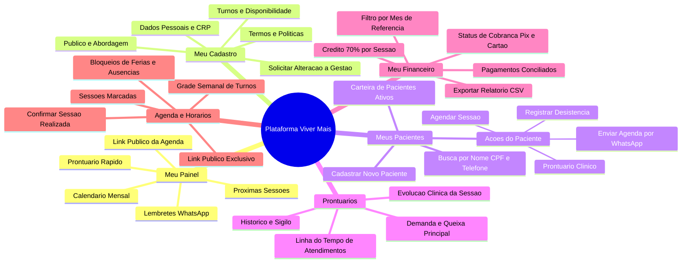
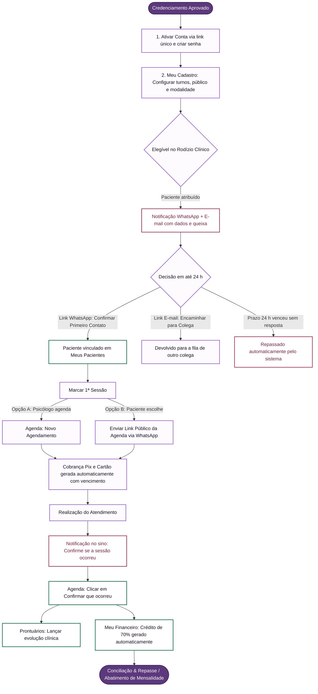
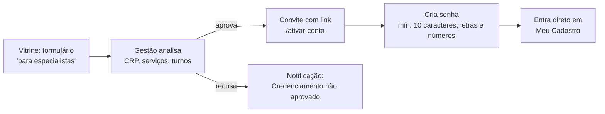
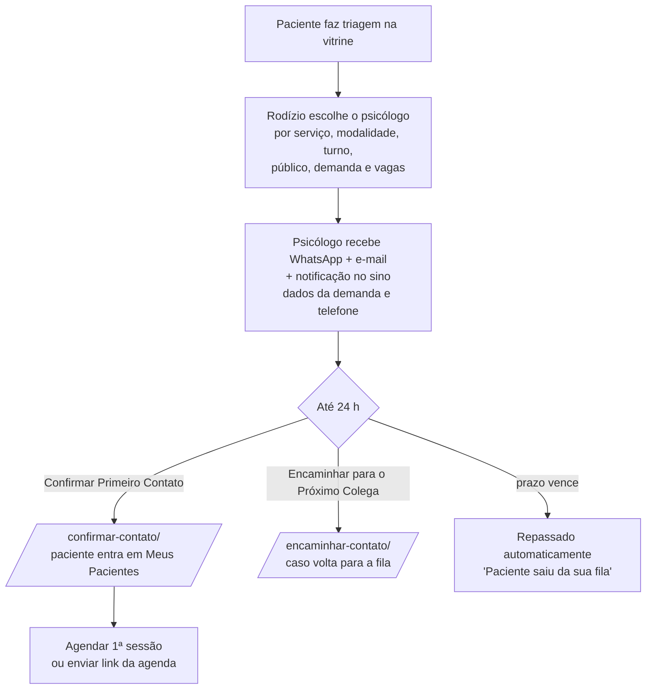
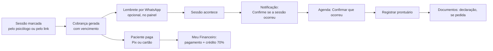

# Mapa da plataforma — perfil Psicólogo

Referência para montar o mapa/guia de uso da plataforma Viver Mais pelos psicólogos.
Levantado a partir do código em 02/10/2026 (rotas em `apps/web/src/app`, menu em
`components/layout/Sidebar.tsx`, regras de acesso em `apps/web/src/proxy.ts`).

> Este documento descreve **o que a tela faz hoje**, não o que o PRD previa.
> O arquivo `fluxo-navegacao-e-funcionalidades.md` está desatualizado (cita rotas
> como `/cockpit/leads` e `/cockpit/atendimento`, que não existem mais).
> 
> 💡 **Versão Visual Interativa / Para Compartilhamento:** Uma página formatada e pronta para imprimir em PDF ou abrir no navegador está disponível em [`guia-visual-psicologo.html`](guia-visual-psicologo.html).

---

## 1. Visão geral

O psicólogo usa a plataforma para quatro coisas:

1. **Receber pacientes** do rodízio da clínica e confirmar o primeiro contato em até 24 h.
2. **Organizar a agenda**: horários disponíveis, bloqueios, sessões marcadas e o link público de agendamento.
3. **Registrar o atendimento**: prontuário, histórico de sessões e documentos do paciente.
4. **Acompanhar o financeiro**: o que foi pago, o que está em aberto e o crédito de 70% de cada sessão.

### Estrutura da tela (após o login)

```
┌──────────────┬───────────────────────────────────────────────┐
│ MENU LATERAL │ CABEÇALHO: [busca] [🔔 notificações] [perfil]  │
│              ├───────────────────────────────────────────────┤
│ Meu Painel   │                                               │
│ Meu Cadastro │              CONTEÚDO DA PÁGINA               │
│ Meus Pacient.│                                               │
│ Prontuários  │                                               │
│ Meu Financ.  │                                               │
│ Agenda       │                                               │
│ ──────────── │                                               │
│ Sair         │                                               │
└──────────────┴───────────────────────────────────────────────┘
```

- No celular o menu vira uma gaveta (botão "Abrir menu" no cabeçalho); no computador pode ser minimizado para só ícones.
- O selo "Perfil ativo: Psicólogo da clínica" aparece no topo do menu.

### Menu lateral (ordem exata)

| # | Item do menu | Rota | Para que serve |
|---|---|---|---|
| 1 | Meu Painel | `/cockpit` | Tela inicial: atalhos, calendário e próximas sessões |
| 2 | Meu Cadastro | `/meu-cadastro` | Perfil profissional, status do credenciamento, termos |
| 3 | Meus Pacientes | `/pacientes` | Lista de pacientes e ações por paciente |
| 4 | Prontuários dos Pacientes | `/linha-do-tempo` | Prontuário e histórico de sessões |
| 5 | Meu Financeiro | `/meu-financeiro` | Pagamentos recebidos, crédito 70% e cobranças |
| 6 | Agenda & Horários | `/agenda` | Grade semanal, bloqueios, sessões e link de agendamento |
| — | Sair da conta | — | Encerra a sessão |

Páginas que **não estão no menu**, mas o psicólogo acessa por botões ou links:

| Rota | Como se chega |
|---|---|
| `/pacientes/[id]/documentos` | Botão "Documentos" no cartão do paciente, no prontuário ou "Gerar declaração" numa sessão realizada (ver §3.4, ainda não publicado) |
| `/confirmar-contato/[id]` | Link recebido por WhatsApp/e-mail quando um paciente novo é atribuído |
| `/encaminhar-contato/[id]` | Link recebido por e-mail para devolver o paciente à fila |
| `/ativar-conta` | Convite recebido após a aprovação do credenciamento |
| `/redefinir-senha` | Link recebido ao pedir nova senha |

### Regras de acesso

- Um psicólogo só vê **os próprios pacientes** (aviso "Sigilo & Privacidade por Profissional Ativo" na lista).
- Se o psicólogo tentar abrir uma rota da gestão (`/gestao/...`, `/convenios`, `/configuracoes`), é redirecionado para `/cockpit`.
- Sem login, qualquer rota interna redireciona para `/login`.

---

## 1.1 Mapa Mental da Plataforma

Visão geral da estrutura de navegação e funcionalidades disponíveis para o especialista:



---

## 1.2 Macro-Fluxograma: A Jornada do Psicólogo

O ciclo de vida completo do especialista na plataforma, do onboarding ao repasse financeiro:



---

## 1.3 Bússola Rápida: "O que você deseja fazer agora?"

Guia de consulta imediata para orientar o psicólogo nas dúvidas mais comuns do dia a dia:

| Objetivo imediato | Onde ir | O que fazer |
|---|---|---|
| **Recebi um paciente novo** | Mensagem de WhatsApp / E-mail recebido | Clicar no link de confirmação em até 24 h *(não fica em uma fila no painel)* |
| **Passar horários para o paciente escolher** | **Meu Painel** ou **Agenda** | Clicar em **Copiar Link** ou **Enviar Wpp** do seu Link Público exclusivo |
| **Marcar uma sessão diretamente** | **Agenda & Horários** | Clicar no botão **Agendar sessão**, escolher paciente, data, frequência e vencimento |
| **Lembrar o paciente da sessão de hoje** | **Meu Painel** | Na lista "Suas Próximas Sessões", clicar no botão **Lembrar Wpp** |
| **A sessão acabou de acontecer** | **Agenda & Horários** | Localizar a sessão e clicar em **Confirmar que ocorreu** |
| **Evoluir o prontuário do paciente** | **Prontuários dos Pacientes** | Selecionar o paciente e registrar a evolução clínica da sessão |
| **Saber quanto tenho a receber** | **Meu Financeiro** | Selecionar o mês para ver os pagamentos conciliados e a coluna **Crédito 70%** |
| **Vou sair de férias ou me ausentar** | **Agenda & Horários** | Em "Períodos bloqueados", adicionar data inicial e final para sumir do link público |
| **Alterar meus turnos de atendimento** | **Meu Cadastro** | Clicar em **Editar perfil** e atualizar seus turnos e públicos atendidos |
| **Paciente desistiu da terapia** | **Meus Pacientes** | No cartão do paciente, clicar em **Registrar desistência** (libera sua vaga no rodízio) |

---

## 2. Entrada na plataforma

### 2.1 Credenciamento e ativação da conta (primeiro acesso)



- O link de ativação é **individual e de uso único**.
- Após aprovado, o perfil entra na vitrine e no rodízio de pacientes.

### 2.2 Login — `/login`

- Campos: **E-mail profissional** e **Senha** (com botão de mostrar/ocultar).
- "Esqueceu a senha?" leva a `/redefinir-senha`. O link enviado vale **2 horas** e é de uso único.
- Ao entrar, o psicólogo cai em **Meu Painel** (`/cockpit`). Administradores caem no painel da gestão.

---

## 3. Páginas

### 3.1 Meu Painel — `/cockpit`

**Objetivo:** ponto de partida do dia, com atalhos para o que mais se usa.

| Bloco | O que mostra | Ações |
|---|---|---|
| Cabeçalho | Título "Meu Painel" | **Cadastrar Paciente** (abre o formulário de novo paciente, ver §3.3) |
| Card "Prontuário Rápido" | Seletor com os pacientes do psicólogo | **Abrir / Lançar Prontuário**: vai para o prontuário do paciente escolhido |
| Card "Link da Sua Agenda" | URL pública e exclusiva de agendamento (`/agendar/<token>`) | **Copiar Link** · **Enviar Wpp** (abre o WhatsApp com mensagem pronta) |
| Calendário do profissional | Mês com dias disponíveis, sessões e bloqueios | Selecionar dias para **bloquear horários pontuais** (ver §3.6) |
| "Suas Próximas Sessões Agendadas" | Até 4 próximas sessões (paciente, dia, hora, modalidade) | **Lembrar Wpp** (mensagem de confirmação pronta para o paciente) · **Prontuário** · **Ver grade completa →** (vai para Agenda) |

> Os pacientes novos do rodízio **não aparecem numa fila neste painel**: a confirmação do primeiro contato é feita pelo link que chega no WhatsApp/e-mail (ver Fluxo A).

---

### 3.2 Meu Cadastro — `/meu-cadastro`

**Objetivo:** manter o perfil profissional atualizado. Turnos, serviços e público-alvo são os critérios usados para encaminhar pacientes ao psicólogo.

**Status do credenciamento** (faixa no topo):

| Status | Significado |
|---|---|
| Em análise pela gestão | Cadastro recebido, em conferência |
| Aprovado e publicado | Perfil na vitrine e elegível a novos pacientes |
| Cadastro recusado | A gestão pediu revisão antes de nova análise |

**Blocos e ações:**

| Bloco | Conteúdo | Quem altera |
|---|---|---|
| **Editar perfil** (botão) | Foto, nome completo, CRP, e-mail, nome social, WhatsApp, endereço, turnos em que atende, público que atende, demandas específicas, modalidade (online/presencial/ambos), tipo de atendimento (particular/social/ambos) | O próprio psicólogo, com efeito imediato |
| **Minha prática** | Resumo do que foi preenchido acima | — |
| **Definido pela gestão** | Turma Viver Mais, pós-graduação, 2ª pós, capacidade de pacientes ativos, serviços homologados | Só a gestão. O psicólogo usa **Solicitar alteração à gestão**, com justificativa opcional; o pedido fica *Pendente* até ser aprovado ou recusado e pode ser cancelado |
| **Termos & Políticas de Parceria** | Termo assinado: prazo de 24 h para o 1º contato, gestão de agenda e pausas, valores social/particular, sigilo e LGPD, rescisão | Só leitura |
| **Como funciona** (lateral) | 1. Enviado → 2. Conferência → 3. Publicado | — |

---

### 3.3 Meus Pacientes — `/pacientes`

**Objetivo:** ver a carteira de pacientes e agir sobre cada um.

**Topo:** indicadores *Pacientes Ativos* e *Sessões Realizadas*, busca por nome, telefone ou CPF e o botão **+ Cadastrar Novo Paciente**.

**Cartão do paciente:** nome, status (**Ativo**, **Em Pausa**, **Alta** ou **Desistente**) e próxima sessão (ou "A agendar").

| Ação no cartão | O que faz |
|---|---|
| ✏️ Editar | Abre o cadastro (contato, CPF, endereço com busca por CEP, contato de emergência, observações cadastrais) |
| **Documentos** | Abre a área de documentos do paciente (§3.4) |
| **Prontuário** | Abre o prontuário do paciente (§3.5) |
| **Agendar** | Abre o "Novo agendamento" já com o paciente selecionado (§3.6) |
| **Enviar Agenda** | Abre o WhatsApp do paciente com o link público de agendamento |
| **Registrar desistência** | Encerra o acompanhamento (ver Fluxo D) |

**Cadastrar novo paciente:** o paciente fica vinculado automaticamente ao psicólogo. Campos: serviço, modalidade, nome (e nome social), telefone com confirmação, data de nascimento, e-mail, CPF, endereço (usado na nota fiscal), convênio com empresa parceira, para quem é o atendimento, contato de emergência, observações e "como conheceu a clínica".

> O campo "Observações cadastrais" é administrativo e não deve receber evolução clínica.

---

### 3.4 Documentos do paciente — `/pacientes/[id]/documentos`

> ⚠️ **Em desenvolvimento, ainda não publicado** (código não commitado em 02/10/2026; depende da migração `051` e da chave `CLINICAL_DOCUMENTS_KEY`). Verificar antes de incluir no guia.

**Objetivo:** emitir documentos psicológicos a partir dos atendimentos concluídos.

- **Modelos:** declaração de comparecimento, declaração de acompanhamento (por período) e relatório psicológico de encaminhamento.
- **Fluxo:** escolher o modelo → informar local, finalidade, atendimento ou período e destinatário → revisar a **prévia** → marcar "Revisei o conteúdo e confirmo" → emitir → **Baixar PDF** para assinar.
- **Histórico de emissões** lista o que já foi emitido. Os documentos não podem ser editados depois de emitidos e não são gerados por IA. O PDF traz um campo para assinatura; a confirmação na tela não vale como assinatura digital.

---

### 3.5 Prontuários dos Pacientes — `/linha-do-tempo`

**Objetivo:** registrar e consultar a evolução clínica de cada paciente.

| Bloco | Conteúdo / ação |
|---|---|
| Cabeçalho | Seletor "Seus Pacientes em Acompanhamento" · **Editar dados** · **Documentos** · **WhatsApp** do paciente · "Voltar para Meus Pacientes" |
| Demanda & Queixa Principal | Resumo da demanda trazida na triagem |
| Próxima Sessão | Data e hora da próxima sessão; se não houver, botão **Abrir Agenda** |
| Sessões Concluídas | Contador |
| **Registrar Prontuário Manual** | Formulário do prontuário: Título · Subjetivo (relato do paciente) · Objetivo (observações do psicólogo) · Avaliação (análise clínica) · Plano (conduta e próximos passos) → salvar |
| Aba **Prontuários** | Linha do tempo das evoluções registradas |
| Aba **Histórico de Sessões** | Todas as sessões do paciente com status (Agendada, Confirmada, Realizada, Cancelada) |

O prontuário é acessível por: menu lateral, "Prontuário Rápido" no painel, botão "Prontuário" no cartão do paciente e nas próximas sessões.

---

### 3.6 Agenda & Horários — `/agenda`

**Objetivo:** controlar quando o psicólogo atende e acompanhar cada sessão.

Os turnos informados em Meu Cadastro já geram uma grade inicial de segunda a sexta. Os blocos aparecem na página nesta ordem:

1. **Link de agendamento:** link público exclusivo, com abrir, copiar e enviar por WhatsApp.
2. **Calendário do profissional:** visão mensal (Disponível / Sessão / Bloqueio). Selecione um ou mais dias (ou "+ Dias úteis do mês") para ver os horários e **bloquear períodos pontuais**. Dias com sessões só podem ser bloqueados depois de reagendar ou cancelar essas sessões.
3. **Grade semanal de atendimento:** para cada dia, ativar "Atender neste dia" e definir duração, modalidade (online/presencial) e períodos. Há a opção "Copiar para…" outros dias.
4. **Períodos bloqueados:** bloqueios longos (férias, congresso, licença), com data inicial e final. Um período bloqueado some do link dos pacientes.
5. **Busca de sessões por paciente**.
6. **Sessões e confirmações:** lista de sessões, incluindo as que os pacientes marcaram pelo link.

**Botão "Agendar sessão" (Novo agendamento):** paciente · serviço · duração (fixa; na avaliação psicológica é livre, de 15 a 240 min) · data e horário · **frequência** (semanal, quinzenal ou personalizada, escolhendo os dias no calendário) · modalidade · responsável pelo pagamento (quando há convênio) · **vencimento da cobrança**: o link e o Pix são encerrados nesse horário exato.

**Estados e ações de cada sessão:**

| Estado | Ações disponíveis |
|---|---|
| Agendada / Confirmada | **Editar** (data, horário, duração, modalidade) · **Reagendar** (o vencimento da cobrança acompanha o novo horário) · **Cancelar** (motivo obrigatório, registrado no histórico) · link de **Pagamento da sessão** · **Editar vencimento** (o Pix pendente é recriado) |
| Aguardando confirmação (sessão já terminou) | **Confirmar que ocorreu** |
| Realizada | **Gerar declaração** (abre Documentos com o atendimento selecionado) |
| Cancelada | Só consulta |

Sessões cobertas pela empresa conveniada não geram cobrança individual.

---

### 3.7 Meu Financeiro — `/meu-financeiro`

**Objetivo:** acompanhar o que entrou e o que está pendente. Os valores são conciliados automaticamente; as cobranças são geradas a partir de cada agendamento.

| Bloco | Conteúdo | Ações |
|---|---|---|
| Filtro | Mês de referência | **Atualizar** · **Exportar CSV** |
| Pagamentos conciliados | Data, paciente, valor pago, **Crédito 70%**, forma (Pix/cartão) | — |
| Status dos atendimentos | Sessão, situação do atendimento (Agendado / Realizado / Cancelado / Custeado pela empresa), valor, recebido, em aberto | **Copiar link** de pagamento · **Editar** a sessão |

O crédito de 70% de cada sessão é a parte do psicólogo. O abatimento na mensalidade da pós-graduação é feito pelo setor financeiro da clínica.

---

### 3.8 Notificações (sino 🔔 no cabeçalho)

Cada notificação leva para a tela e a seção onde a ação é feita. Há a opção "Marcar todas como lidas".

| Notificação | Leva para |
|---|---|
| Novo paciente para contatar / Paciente repassado para você (com o prazo de 24 h restante) | Meu Painel |
| Primeiro contato confirmado | Meus Pacientes |
| Paciente saiu da sua fila | Meu Painel |
| Sessão agendada (inclusive pelo link público) | Agenda, destacando a sessão |
| **Confirme se a sessão ocorreu** | Agenda, destacando a sessão |
| Pagamento recebido | Meu Financeiro, no mês do pagamento |
| Credenciamento aprovado / não aprovado | Meu Cadastro, no status |
| Complete seu cadastro para receber pacientes | Meu Cadastro, em "Minha prática" |
| Limite de pacientes ativos atingido | Meus Pacientes |
| Sua turma foi encerrada / Você está pausado no rodízio | Meu Cadastro, no status |

---

## 4. Fluxos principais (ponta a ponta)

### Fluxo A — Paciente novo do rodízio



### Fluxo B — Ciclo de uma sessão



Alterações no meio do caminho: **Reagendar** (o vencimento acompanha) ou **Cancelar** (com motivo obrigatório).

### Fluxo C — Agendamento pelo próprio paciente (link público)

1. O psicólogo envia o link (Painel, Agenda ou "Enviar Agenda" no cartão do paciente).
2. O paciente abre `/agendar/<token>` e informa o **CPF** para ser identificado.
3. O paciente vê os horários livres (grade semanal menos os bloqueios e as sessões já marcadas), escolhe um ou vários dias e confirma.
4. Se já tem sessão marcada, o paciente pode **reagendar** pelo mesmo link, mas não quando faltam menos de 2 h; nesse caso é orientado a falar pelo WhatsApp.
5. O psicólogo recebe a notificação "Sessão agendada" e a sessão aparece na Agenda.
6. O paciente paga em `/pagar/sessao/<token>` por **Pix** ou **cartão**. Quem paga 4 ou mais sessões do mês de uma vez ganha 10% de desconto.

### Fluxo D — Desistência do paciente

1. Meus Pacientes → cartão → **Registrar desistência**.
2. Informar o motivo principal, os detalhes da saída, uma ação sugerida de reengajamento e se o paciente **autoriza ser oferecido a outro psicólogo**. Não incluir conteúdo de prontuário.
3. O paciente passa a "Desistente", deixa de contar como ativo, **a vaga volta para o rodízio** e o caso vai para a fila de reengajamento da gestão.

### Fluxo E — Manter o perfil elegível

Meu Cadastro → manter turnos, público e modalidade atualizados → para mudar serviços, capacidade ou dados acadêmicos usar **Solicitar alteração à gestão** → bloquear férias e ausências na Agenda, para não receber agendamentos nesses períodos.

---

## 5. Pontos de atenção para o guia

Itens do código atual que podem confundir o psicólogo. Decidir se o guia deve explicá-los ou se é melhor corrigi-los antes de publicá-lo:

1. **A busca do cabeçalho não funciona.** O campo "Buscar paciente ou sessão..." não está ligado a nada. As buscas que funcionam ficam em Meus Pacientes e na Agenda.
2. **Não existe fila de pacientes novos no painel.** As notificações "Novo paciente para contatar" levam a Meu Painel, mas a confirmação só acontece pelo link recebido no WhatsApp/e-mail. O guia precisa deixar isso claro.
3. **Documentos do paciente** (§3.4) ainda não foram publicados.
4. **Declaração de horas de estágio** (`/relatorios/declaracao`) é emitida pela gestão, não pelo psicólogo. Ela não deve entrar no mapa do psicólogo.
5. O menu chama a página de "Prontuários dos Pacientes", mas a rota é `/linha-do-tempo` e o título interno é "Prontuário Clínico do Paciente". No guia, usar o nome do menu.
